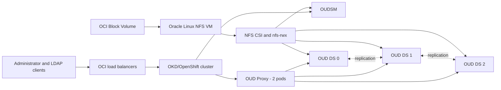
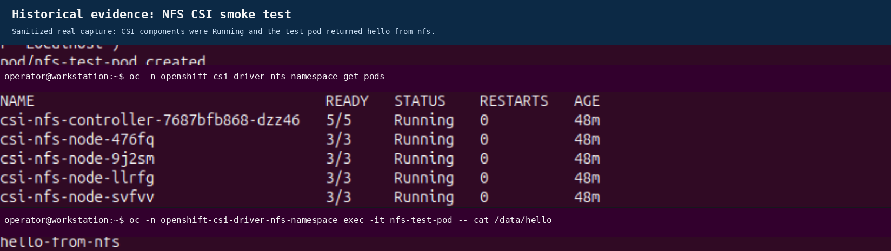

# Oracle OUD and OUDSM on OKD/OpenShift in OCI

> **MaseruTel Enterprise Systems Lab** — a sanitized portfolio reconstruction of a successfully deployed Oracle directory-services platform on OKD/OpenShift in Oracle Cloud Infrastructure.

This repository documents how I provisioned an OCI-hosted OKD/OpenShift cluster, prepared NFS CSI-backed persistent storage, deployed Oracle Unified Directory, configured OUD Proxy routing, and deployed OUDSM with a persistent WebLogic domain. It is evidence-led: retained logs, commands, manifests, and screenshots establish what was implemented, while official vendor documentation explains the underlying platform behavior.

> [!IMPORTANT]
> All names, domains, IP addresses, suffixes, credentials, OCIDs, and customer references are sanitized. Confidential source artifacts are intentionally excluded.

## Architecture at a glance



## What this project demonstrates

- OCI Resource Manager and Terraform-based cluster infrastructure provisioning evidence.
- A six-node OKD/OpenShift cluster with three control-plane and three worker nodes.
- OCI load-balancer separation for Kubernetes API, application ingress, and LDAP traffic.
- An Oracle Linux NFS server backed by a 1 TB OCI Block Volume.
- NFS CSI dynamic provisioning through one cluster-scoped `nfs-rwx` StorageClass.
- Three OUD directory-server replicas with separate PVC-backed data directories.
- Two OUD Proxy pods with LDAP server extensions and proportional routing to three OUD endpoints.
- OUDSM initialized safely with one replica and subsequently scaled after domain readiness.
- Failure diagnosis across OCI networking, OpenShift ingress, SCCs, CSI, NFS, Helm, OUD Proxy, and OUDSM.

## Evidence status

| Area | Status | Summary |
|---|---|---|
| OCI Resource Manager | Verified | Retained job log shows provider initialization and OCI resource refresh/create operations. |
| Cluster topology | Observed | Screenshots show three control-plane and three worker nodes ready. |
| NFS CSI | Verified | Test PVC and pod wrote and read `hello-from-nfs`; a dynamic `pvc-*` directory was observed on the server. |
| OUD storage | Verified design, partial retained runtime evidence | One StorageClass, namespaced PVCs, separate directories per replica. |
| OUD Proxy | Verified in part | Two pods, public LDAP NodePort `30089`, three LDAP extensions, and proportional routes were observed. Final network-group mapping remains `VERIFY` until the completion output is recovered. |
| OUDSM | Observed and reconstructed | Image/values and UI evidence exist; exact final Route target and PVC capacity remain in the verify register. |
| LDAPS external path | Verify | Do not treat the remembered `636 -> 30636` path as final until listener and Service evidence is recovered. |

## Selected execution evidence

The repository includes only evidence that survived both relevance and sanitization review. This historical capture shows the successful NFS CSI smoke test used before deploying the Oracle workloads.



See the [evidence policy](evidence/README.md) for artifacts that were recreated, rejected, or kept private.

## Start here

1. [Project overview](docs/00-project-overview.md)
2. [Recovered deployment contract](docs/02-recovered-deployment-contract.md)
3. [Successful deployment runbook](docs/03-oci-foundation.md)
4. [NFS and dynamic storage](docs/06-nfs-server-and-block-volume.md)
5. [OUD deployment](docs/09-oud-helm-deployment.md)
6. [OUD Proxy routing](docs/10-oud-proxy-deployment.md)
7. [OUDSM deployment](docs/11-oudsm-helm-deployment.md)
8. [Validation](docs/13-validation.md)
9. [Troubleshooting and recovery](docs/14-troubleshooting-and-recovery.md)
10. [Operations command reference](docs/19-operations-command-reference.md)

## Repository map

```text
README.md                 Project landing page and verified architecture summary
docs/                     Evidence-led deployment and recovery documentation
diagrams/                 Mermaid-first diagram sources, D2 and draw.io sources
manifests/                Sanitized Kubernetes and OpenShift examples
helm/                     Sanitized values and chart applicability notes
scripts/validation/       Safe PASS/FAIL/VERIFY/SKIPPED checks
scripts/security/         Redaction and secret scanning
evidence/                 Public evidence policy; confidential originals excluded
reference/terraform/      Clearly labelled reference material, not claimed as original code
```

## Reproduction scope

This is a historical reconstruction, not a currently hosted public service. The repository provides the successful implementation sequence, sanitized manifests, architecture sources, validation commands, and operational lessons. Commands that could not be rerun against the retired historical environment are labelled `VERIFY` or `SKIPPED` rather than reported as passing.

## What I personally implemented

I worked across OCI provisioning, OKD/OpenShift installation and access, load-balancer troubleshooting, NFS server and CSI integration, Oracle image and Helm preparation, OUD deployment, OUD Proxy configuration, OUDSM deployment, and end-to-end validation. Oracle supplied the product images and Helm charts; Red Hat/OpenShift supplied the cluster platform; AI assisted with reconstruction, comparison, and documentation, but unsupported claims were not promoted to verified facts.

## Security

Read [SECURITY.md](SECURITY.md) and [the redaction policy](docs/15-security-and-redaction.md) before adding evidence. Never commit credentials, customer identifiers, OCIDs, private hostnames, real IP addresses, LDAP data, keystores, pull secrets, or raw browser screenshots without review.

## Official documentation

The major documents link to the applicable Oracle, Red Hat/OpenShift, Kubernetes, Kubernetes NFS CSI, and OCI references. See [references.md](docs/references.md).
