# Mermaid architecture gallery

This page is generated from `diagrams/mermaid/*.mmd`. Edit the `.mmd` source and run `python3 scripts/rendering/build-mermaid-gallery.py`; do not edit generated diagram blocks by hand.

> Solid paths are verified or strongly observed. Dashed or explicitly labelled `VERIFY` paths remain unresolved.

## 1. Final platform context

Source: [`mermaid/01-final-platform-context.mmd`](mermaid/01-final-platform-context.mmd)

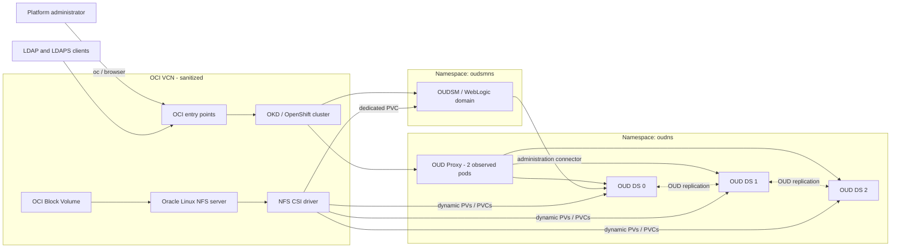

## 2. OCI network topology

Source: [`mermaid/02-final-oci-network-topology.mmd`](mermaid/02-final-oci-network-topology.mmd)

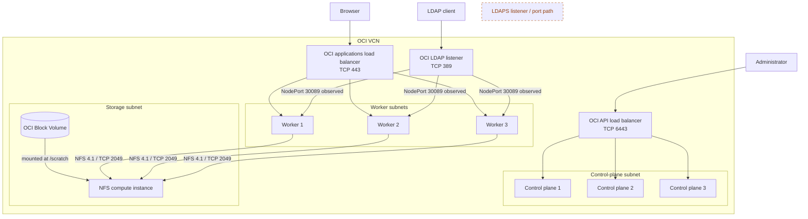

## 3. OKD/OpenShift cluster topology

Source: [`mermaid/03-final-okd-cluster-topology.mmd`](mermaid/03-final-okd-cluster-topology.mmd)

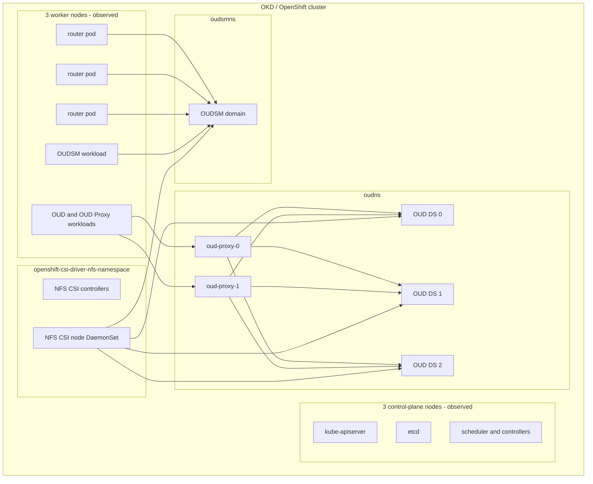

## 4. Load-balancer and ingress flows

Source: [`mermaid/04-final-load-balancer-and-ingress-flow.mmd`](mermaid/04-final-load-balancer-and-ingress-flow.mmd)

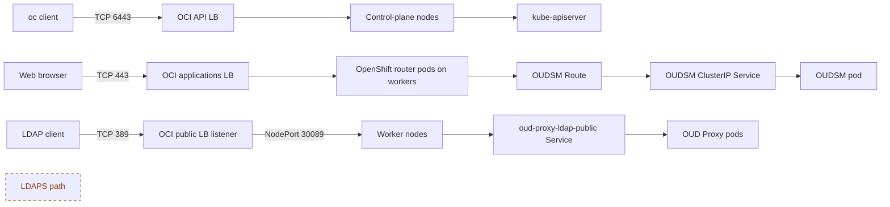

## 5. NFS CSI storage flow

Source: [`mermaid/05-final-nfs-csi-storage-flow.mmd`](mermaid/05-final-nfs-csi-storage-flow.mmd)

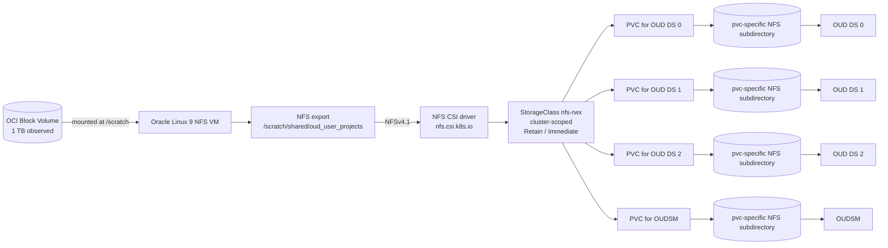

## 6. OUD StatefulSet and storage

Source: [`mermaid/06-final-oud-statefulset-storage.mmd`](mermaid/06-final-oud-statefulset-storage.mmd)

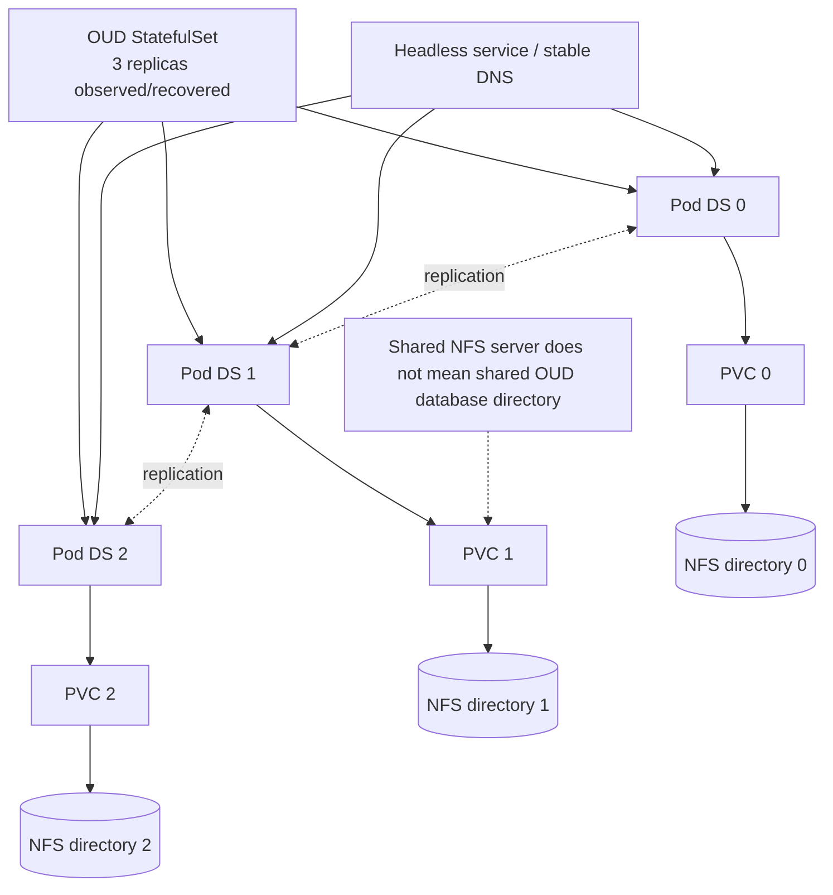

## 7. OUD replication topology

Source: [`mermaid/07-final-oud-replication-topology.mmd`](mermaid/07-final-oud-replication-topology.mmd)

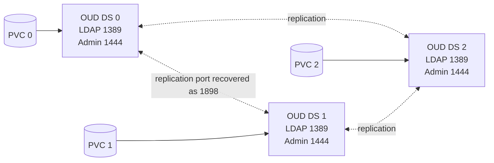

## 8. OUD Proxy routing

Source: [`mermaid/08-final-oud-proxy-routing.mmd`](mermaid/08-final-oud-proxy-routing.mmd)

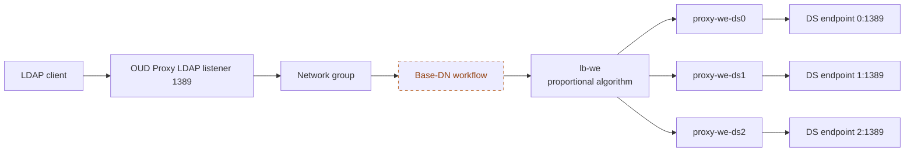

## 9. OUDSM access flow

Source: [`mermaid/09-final-oudsm-access-flow.mmd`](mermaid/09-final-oudsm-access-flow.mmd)

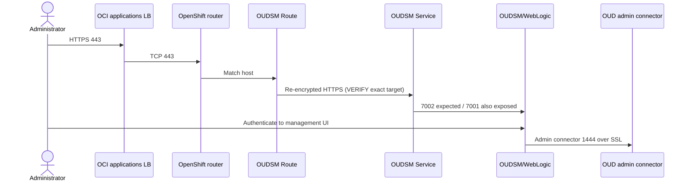

## 10. Successful deployment sequence

Source: [`mermaid/10-final-deployment-sequence.mmd`](mermaid/10-final-deployment-sequence.mmd)

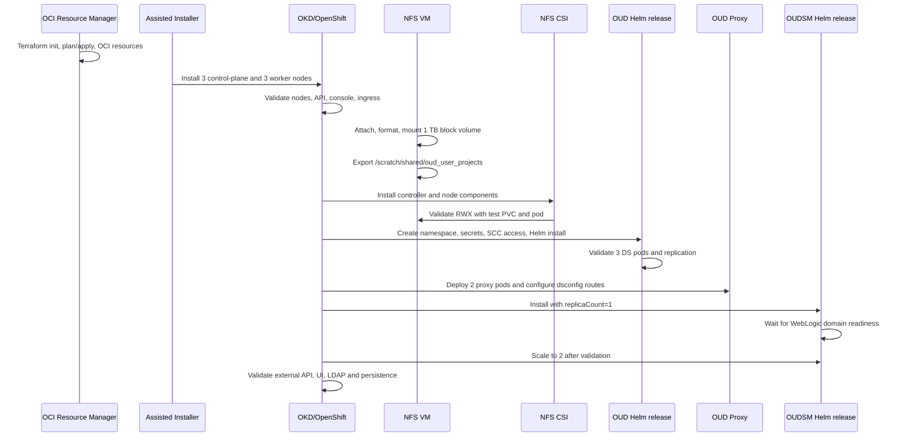

## 11. NFS failure recovery

Source: [`mermaid/11-final-nfs-failure-recovery.mmd`](mermaid/11-final-nfs-failure-recovery.mmd)

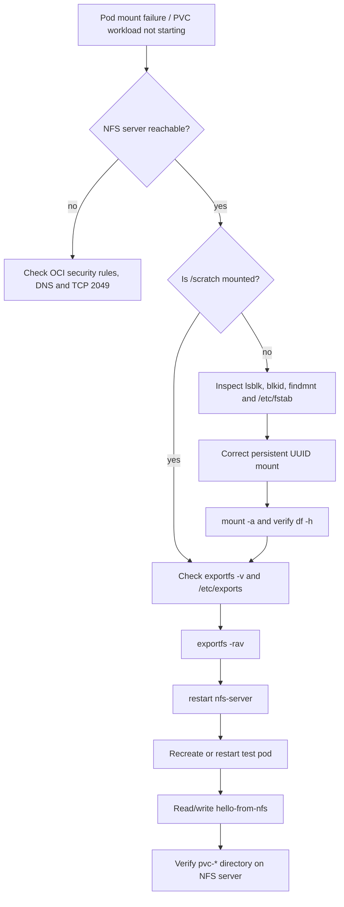

## 12. Security trust boundaries

Source: [`mermaid/12-final-security-trust-boundaries.mmd`](mermaid/12-final-security-trust-boundaries.mmd)

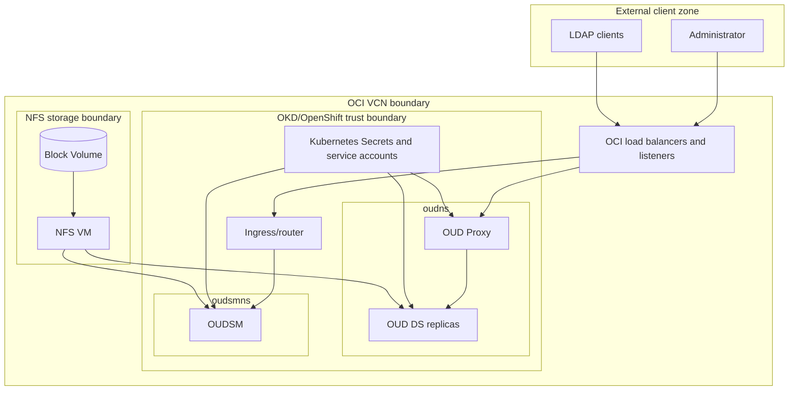
