# Presentation transcript: OUD on OKD/OpenShift in OCI

The original presentation is preserved in sanitized PowerPoint and PDF form.
The slide images below are also available under `artifacts/presentation/slides/`.

## Slide 1: Deploying  OUD on OKD/OpenShift on Oracle Cloud Infrastructure

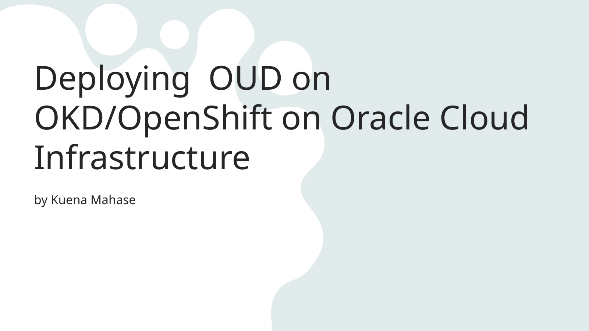

- by Kuena Mahase

## Slide 2: Table of Contents

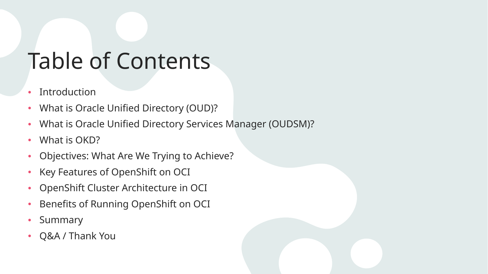

- Introduction
- What is Oracle Unified Directory (OUD)?
- What is Oracle Unified Directory Services Manager (OUDSM)?
- What is OKD?
- Objectives: What Are We Trying to Achieve?
- Key Features of OpenShift on OCI
- OpenShift Cluster Architecture in OCI
- Benefits of Running OpenShift on OCI
- Summary
- Q&A / Thank You

## Slide 3: What is OUD ?

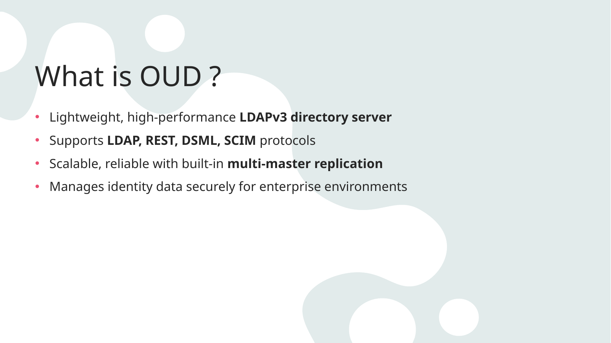

- Lightweight, high-performance LDAPv3 directory server
- Supports LDAP, REST, DSML, SCIM protocols
- Scalable, reliable with built-in multi-master replication
- Manages identity data securely for enterprise environments

## Slide 4: What is OUDSM?

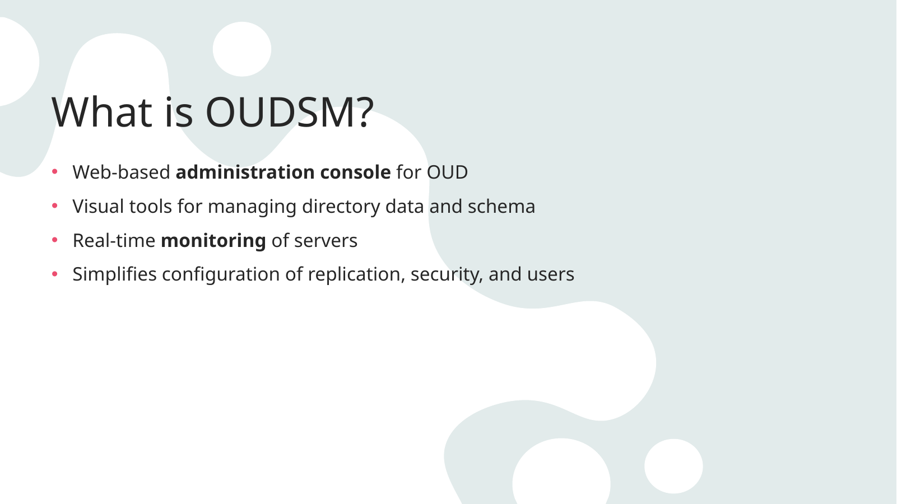

- Web-based administration console for OUD
- Visual tools for managing directory data and schema
- Real-time monitoring of servers
- Simplifies configuration of replication, security, and users

## Slide 5: What is OKD?

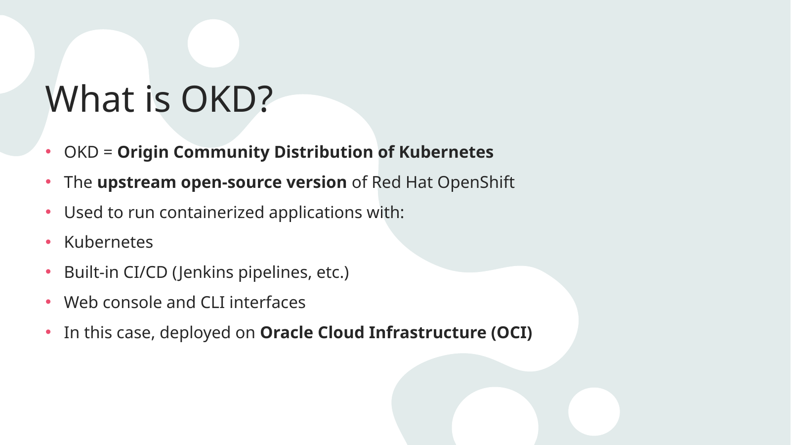

- OKD = Origin Community Distribution of Kubernetes
- The upstream open-source version of Red Hat OpenShift
- Used to run containerized applications with:
- Kubernetes
- Built-in CI/CD (Jenkins pipelines, etc.)
- Web console and CLI interfaces
- In this case, deployed on Oracle Cloud Infrastructure (OCI)

## Slide 6: What are we trying to achive?

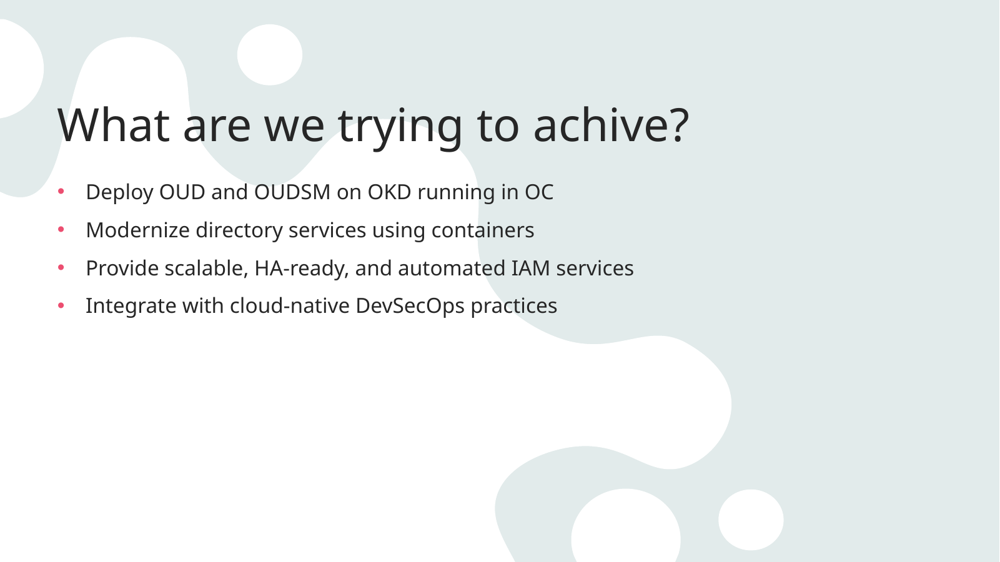

- Deploy OUD and OUDSM on OKD running in OC
- Modernize directory services using containers
- Provide scalable, HA-ready, and automated IAM services
- Integrate with cloud-native DevSecOps practices

## Slide 7: Key Features of OpenShift on OCI

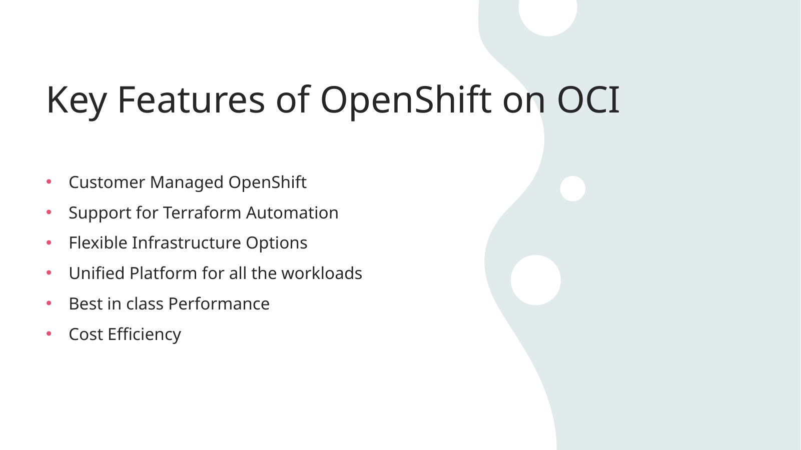

- Customer Managed OpenShift
- Support for Terraform Automation
- Flexible Infrastructure Options
- Unified Platform for all the workloads
- Best in class Performance
- Cost Efficiency

## Slide 8: Oracle Resource Manager

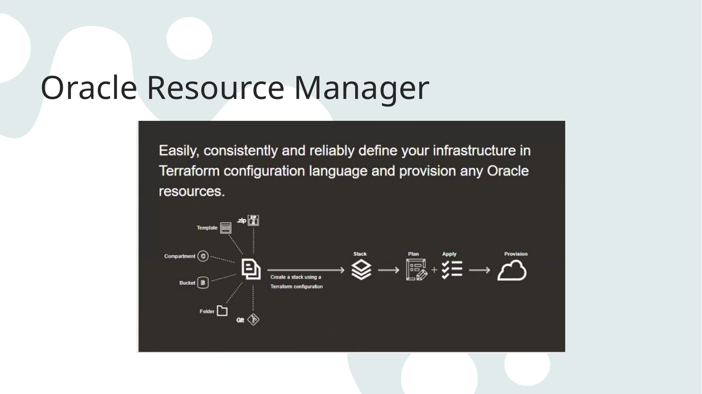

## Slide 9: Cluster Architecture in OCI

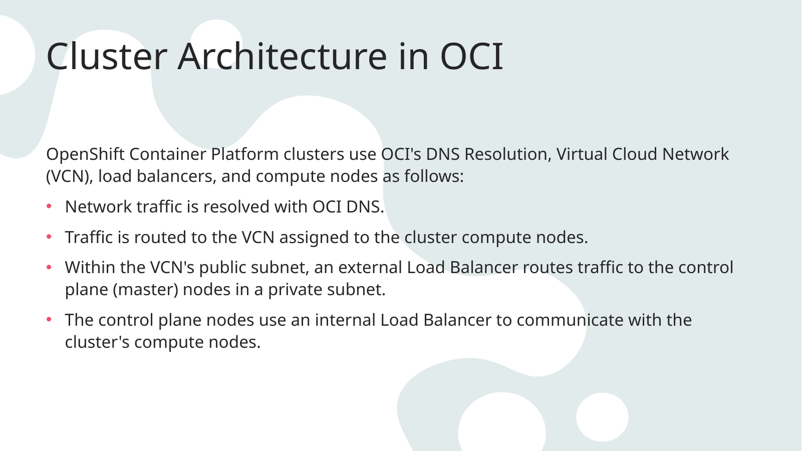

- OpenShift Container Platform clusters use OCI's DNS Resolution, Virtual Cloud Network (VCN), load balancers, and compute nodes as follows:
- Network traffic is resolved with OCI DNS.
- Traffic is routed to the VCN assigned to the cluster compute nodes.
- Within the VCN's public subnet, an external Load Balancer routes traffic to the control plane (master) nodes in a private subnet.
- The control plane nodes use an internal Load Balancer to communicate with the cluster's compute nodes.

## Slide 10: Cluster Architecture Design

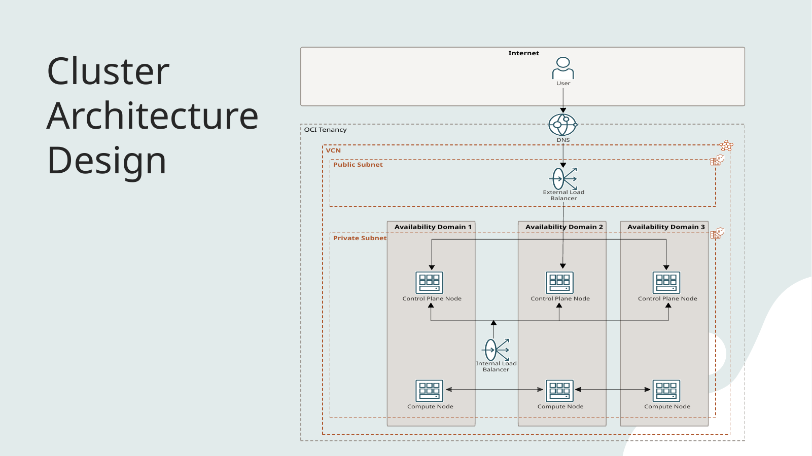

## Slide 11: Benefits of Running OpenShift on OCI Key benefits

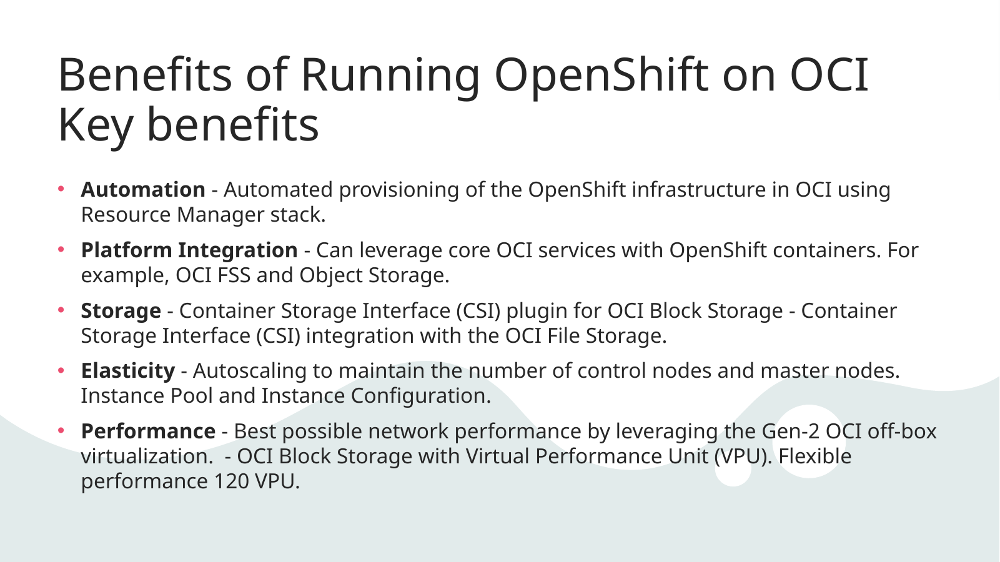

- Automation - Automated provisioning of the OpenShift infrastructure in OCI using Resource Manager stack.
- Platform Integration - Can leverage core OCI services with OpenShift containers. For example, OCI FSS and Object Storage.
- Storage - Container Storage Interface (CSI) plugin for OCI Block Storage - Container Storage Interface (CSI) integration with the OCI File Storage.
- Elasticity - Autoscaling to maintain the number of control nodes and master nodes. Instance Pool and Instance Configuration.
- Performance - Best possible network performance by leveraging the Gen-2 OCI off-box virtualization.  - OCI Block Storage with Virtual Performance Unit (VPU). Flexible performance 120 VPU.

## Slide 12: Implementation flow using assisted installer of OKD on OCI

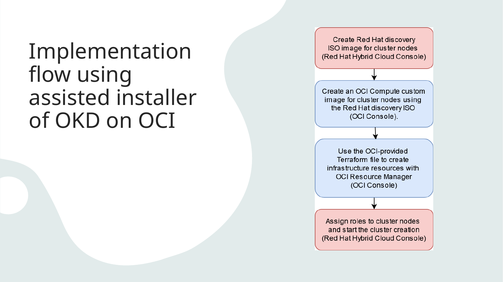

## Slide 13: Implementation flow using Assisted Installer OKD on OCI (detailed)

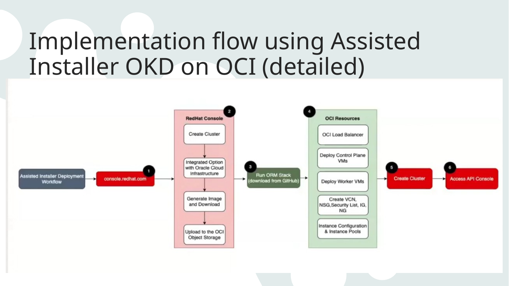

## Slide 14: Machine’s Path to the Console

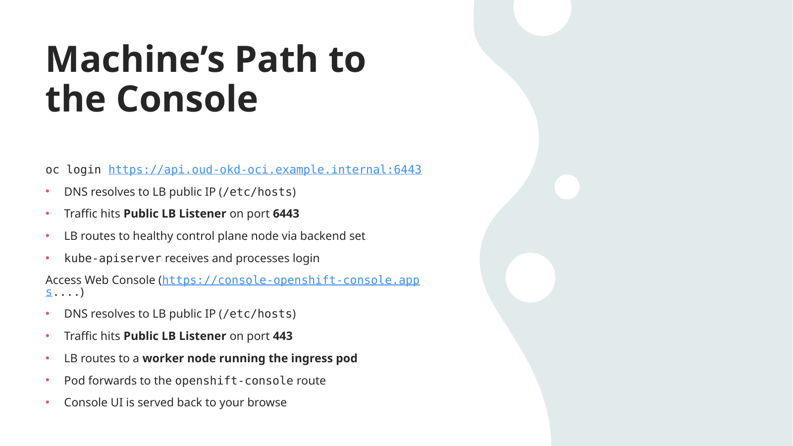

- oc login https://api.oud-okd-oci.example.internal:6443
- DNS resolves to LB public IP (/etc/hosts)
- Traffic hits Public LB Listener on port 6443
- LB routes to healthy control plane node via backend set
- kube-apiserver receives and processes login
- Access Web Console (https://console-openshift-console.apps....)
- DNS resolves to LB public IP (/etc/hosts)
- Traffic hits Public LB Listener on port 443
- LB routes to a worker node running the ingress pod
- Pod forwards to the openshift-console route
- Console UI is served back to your browse

## Slide 15: Terraform Stacks: Inputs, Processing, and Outputs

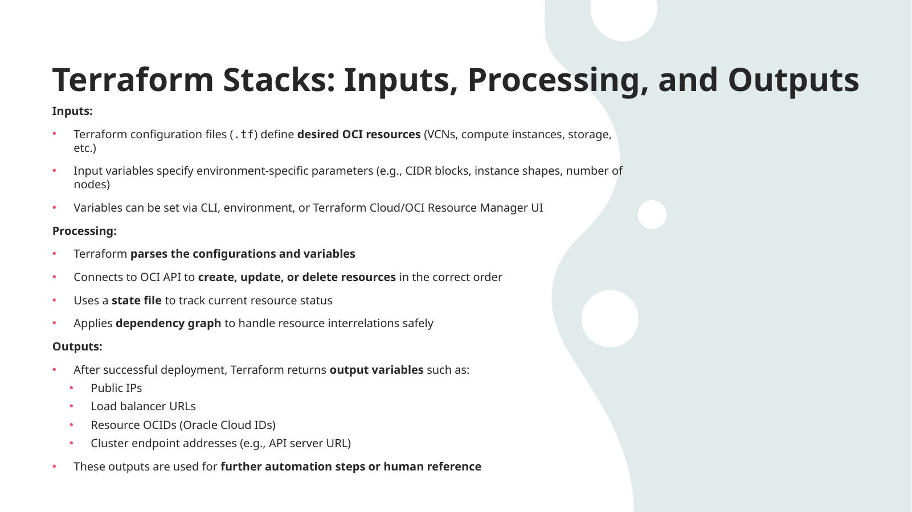

- Inputs:
- Terraform configuration files (.tf) define desired OCI resources (VCNs, compute instances, storage, etc.)
- Input variables specify environment-specific parameters (e.g., CIDR blocks, instance shapes, number of nodes)
- Variables can be set via CLI, environment, or Terraform Cloud/OCI Resource Manager UI
- Processing:
- Terraform parses the configurations and variables
- Connects to OCI API to create, update, or delete resources in the correct order
- Uses a state file to track current resource status
- Applies dependency graph to handle resource interrelations safely
- Outputs:
- After successful deployment, Terraform returns output variables such as:
- Public IPs
- Load balancer URLs
- Resource OCIDs (Oracle Cloud IDs)
- Cluster endpoint addresses (e.g., API server URL)
- These outputs are used for further automation steps or human reference

## Slide 16: What's Next? Accessing the Web Console to deploy our Application(OUD/OUDSM)

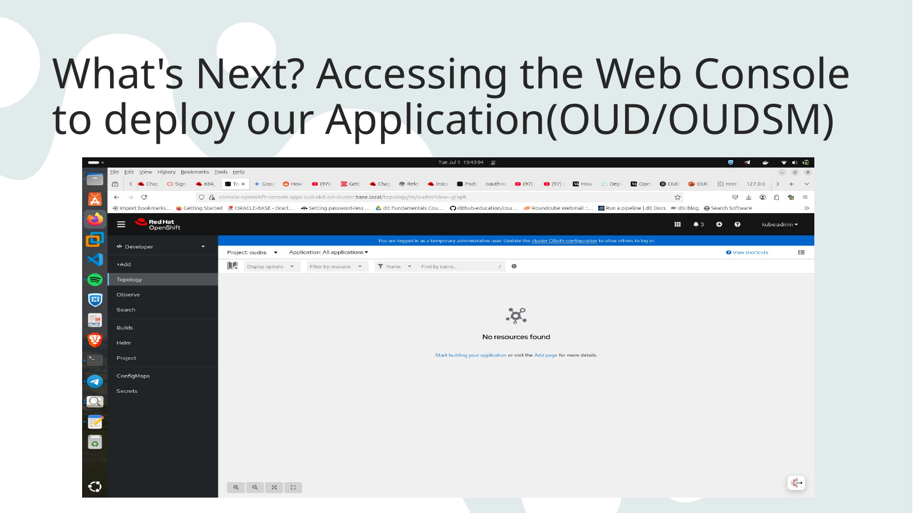

## Slide 17: Q&A

- Thank you.
