# Work evidence gallery

This gallery represents all 130 screenshots supplied in the historical archive.
The raw full-resolution archive is intentionally not committed because several
screens show real cloud identifiers, internal hostnames, addresses, or access
material. Every original is accounted for by filename and SHA-256 in
`source-manifest.csv`; sanitized thumbnails and contact sheets preserve the
implementation chronology.

## Contact sheets

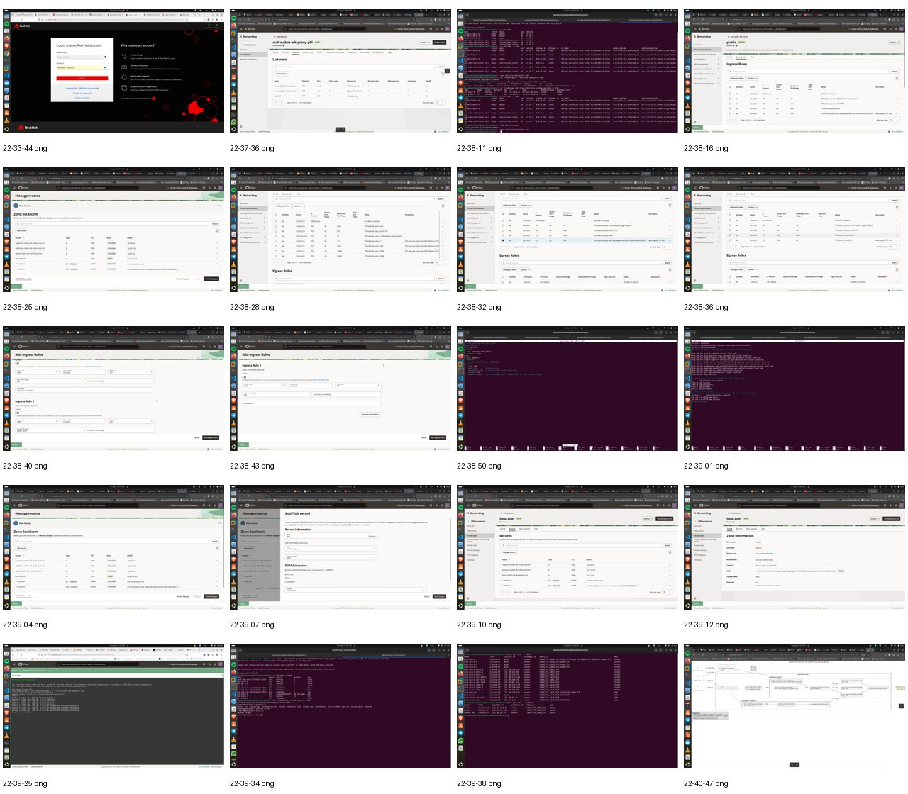

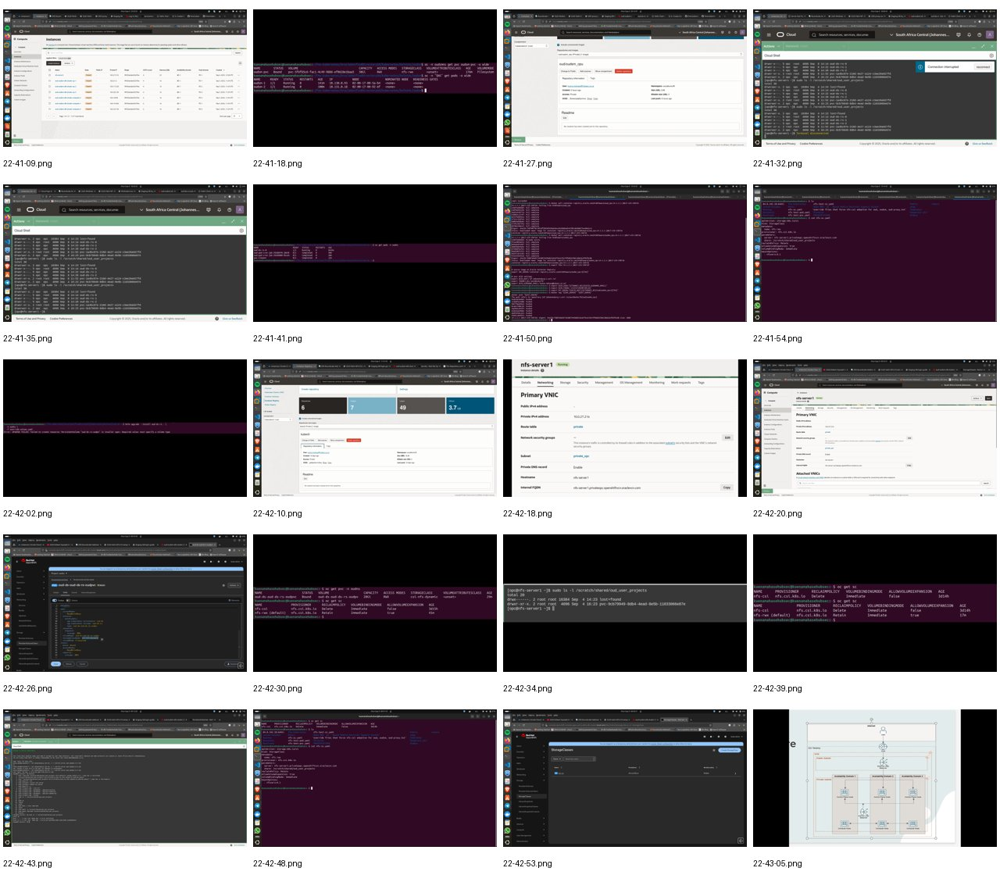

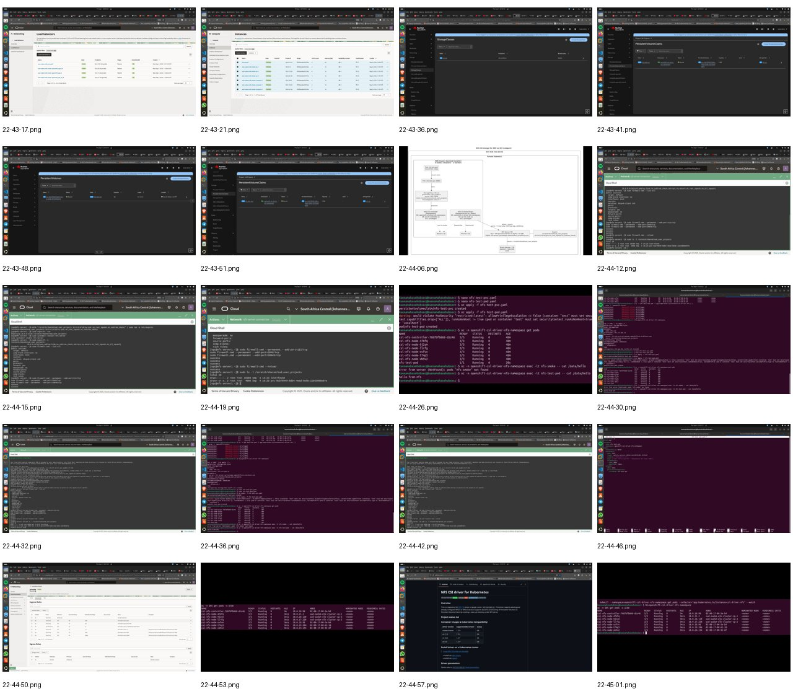

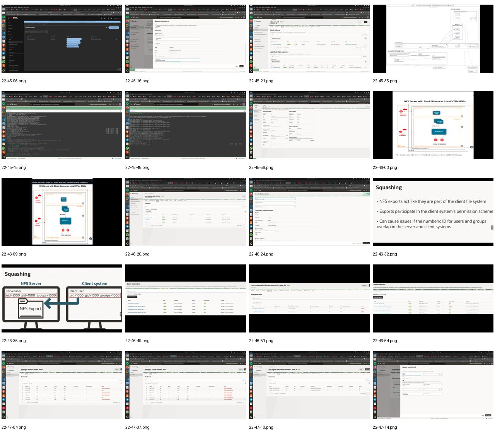

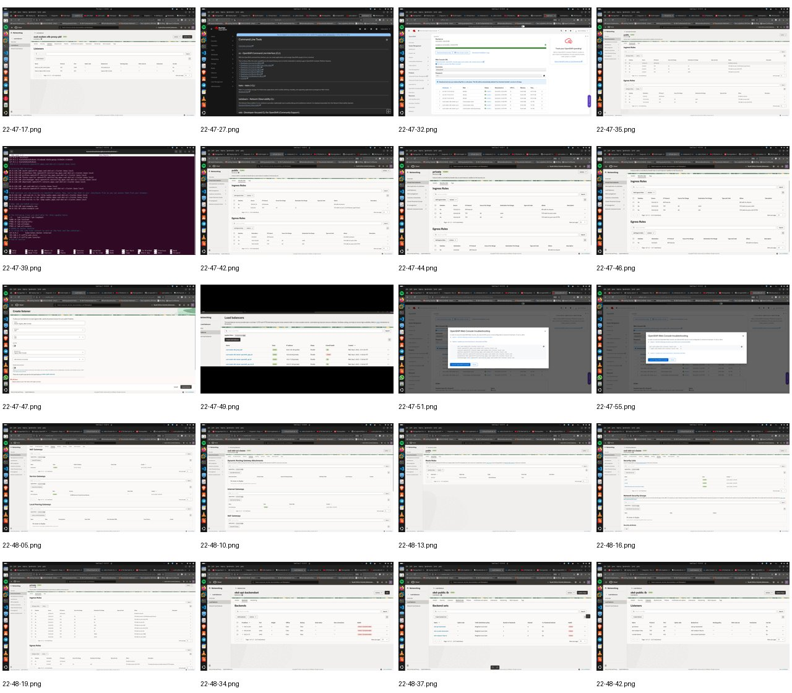

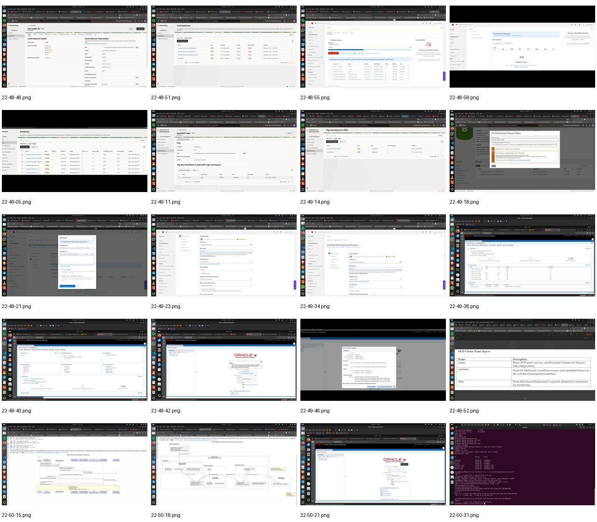

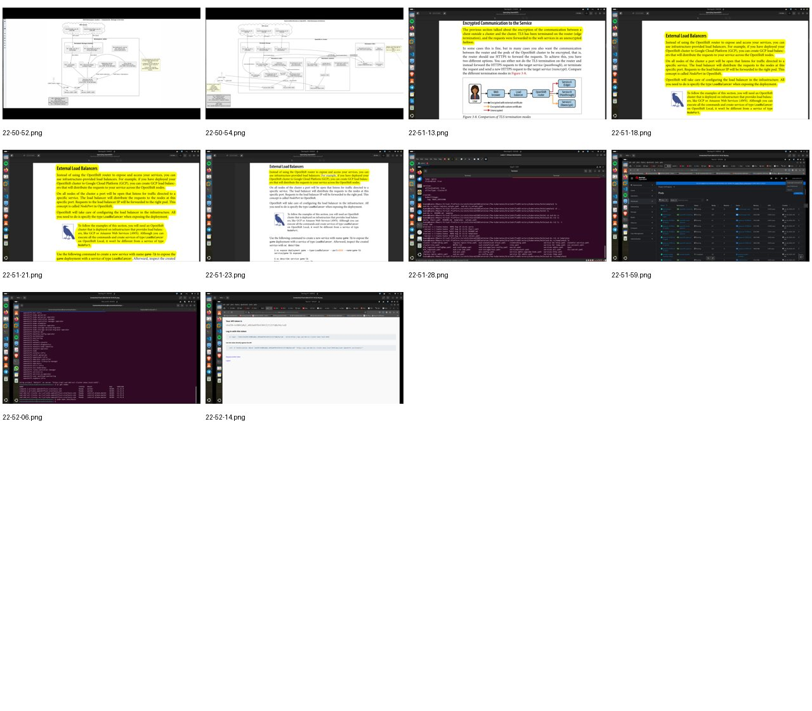

## Individual sanitized thumbnails

### Evidence 001

- Source: `Screenshot from 2026-07-28 22-33-44.png`
- Category: DNS, load balancers, OUDSM and terminal checks
- SHA-256: `c30f28bbb19d4f85603d146ce0a980e9023831d3fadd816eb74fa78a53c0263c`

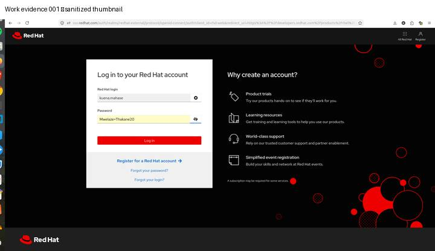

### Evidence 002

- Source: `Screenshot from 2026-07-28 22-37-36.png`
- Category: DNS, load balancers, OUDSM and terminal checks
- SHA-256: `2fca9109c284ae4f4c7b4012baf8af3d2edecd9623f3b353d72dc699aed96f38`

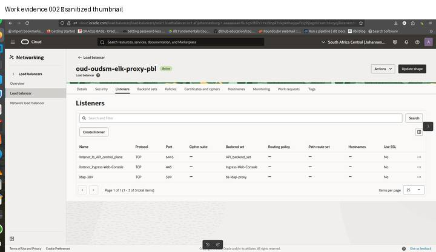

### Evidence 003

- Source: `Screenshot from 2026-07-28 22-38-11.png`
- Category: DNS, load balancers, OUDSM and terminal checks
- SHA-256: `5c2e5b14a8f539ee1703d84fcdc78d92464c12d44b090e771bb556090b46ea5a`

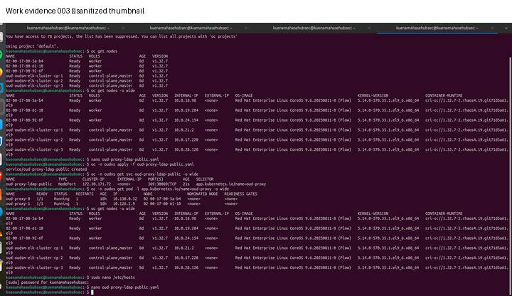

### Evidence 004

- Source: `Screenshot from 2026-07-28 22-38-16.png`
- Category: DNS, load balancers, OUDSM and terminal checks
- SHA-256: `76ce61f3cec1ddbcd90d84b0da2ecb77f81ee1af05ab8f34f211802f518a39b1`

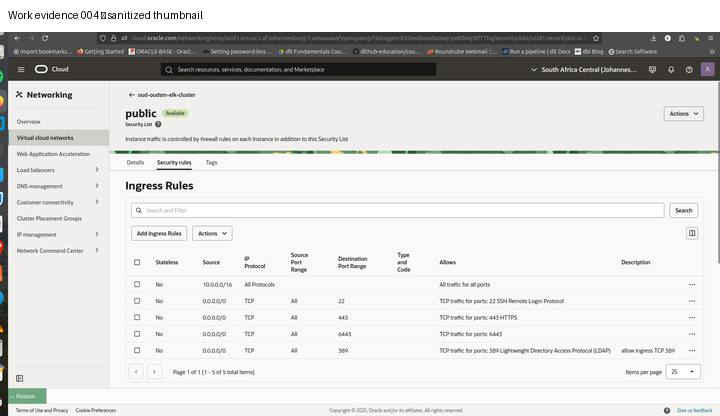

### Evidence 005

- Source: `Screenshot from 2026-07-28 22-38-25.png`
- Category: DNS, load balancers, OUDSM and terminal checks
- SHA-256: `740f230f819db8a51862e8f1056158864a86f608339dc9637db2389957c3baa8`

### Evidence 006

- Source: `Screenshot from 2026-07-28 22-38-28.png`
- Category: DNS, load balancers, OUDSM and terminal checks
- SHA-256: `d1cd9fc84692d5dad8b6d2e05af9f8e76a6319b3d87a7742e8c21bdb29aa253a`

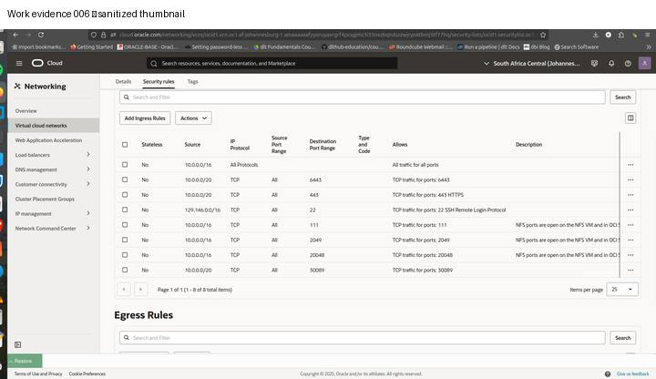

### Evidence 007

- Source: `Screenshot from 2026-07-28 22-38-32.png`
- Category: DNS, load balancers, OUDSM and terminal checks
- SHA-256: `07834d8f6a419624fb2112663b3bbb7bc11f03d526e2415ef26a5853dd28c8d8`

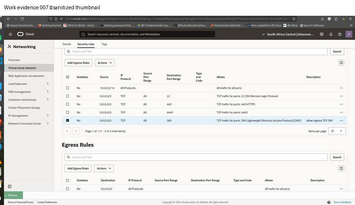

### Evidence 008

- Source: `Screenshot from 2026-07-28 22-38-36.png`
- Category: DNS, load balancers, OUDSM and terminal checks
- SHA-256: `9330192a99481acbd5228db0ec9da79fb559e681da2910914e15ebcf24e80a80`

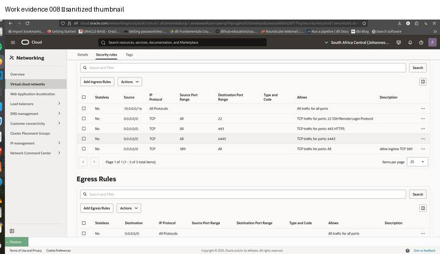

### Evidence 009

- Source: `Screenshot from 2026-07-28 22-38-40.png`
- Category: DNS, load balancers, OUDSM and terminal checks
- SHA-256: `b0b041694f8e29b3451c4b2f6536dc259c1d437dc4949acd76e31253c0fb1df7`

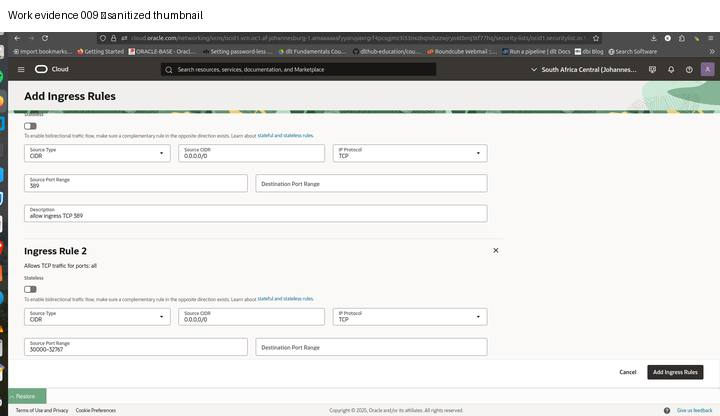

### Evidence 010

- Source: `Screenshot from 2026-07-28 22-38-43.png`
- Category: DNS, load balancers, OUDSM and terminal checks
- SHA-256: `874c6312f0b709a964f11758807cd600eed4fb831817483733fe23a7567a1426`

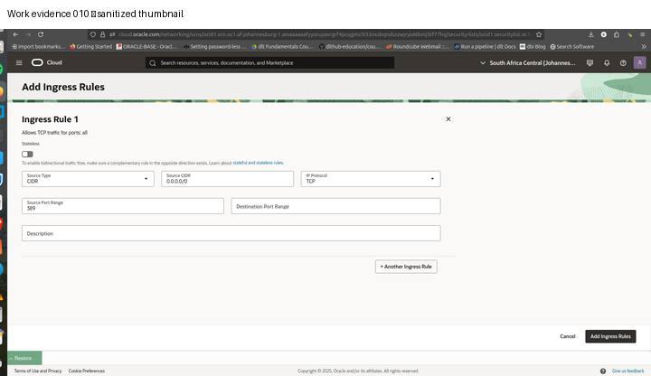

### Evidence 011

- Source: `Screenshot from 2026-07-28 22-38-50.png`
- Category: DNS, load balancers, OUDSM and terminal checks
- SHA-256: `a0183665d3bfc32e9619e5e289bcf3b02954e739e9126f911be7c8b1a42ff728`

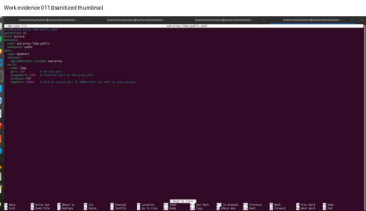

### Evidence 012

- Source: `Screenshot from 2026-07-28 22-39-01.png`
- Category: DNS, load balancers, OUDSM and terminal checks
- SHA-256: `f94973e91476dc6a902320aeced725ee2e3ab9750170631ae983b2d3ea1ef005`

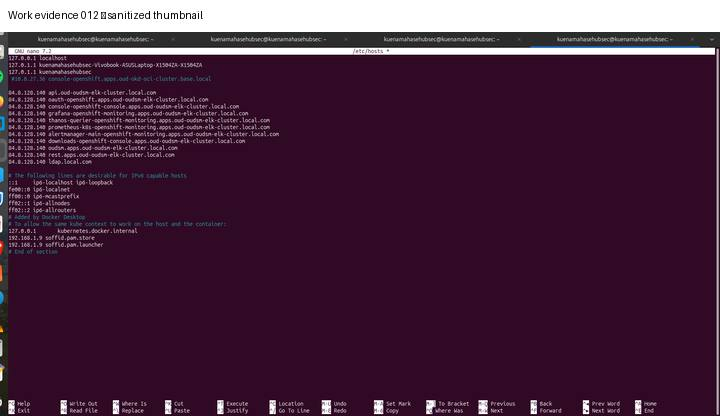

### Evidence 013

- Source: `Screenshot from 2026-07-28 22-39-04.png`
- Category: DNS, load balancers, OUDSM and terminal checks
- SHA-256: `184752abbc288d0232788ee5b81d3590ec729c0928473dd8a2ae4482c4e21f99`

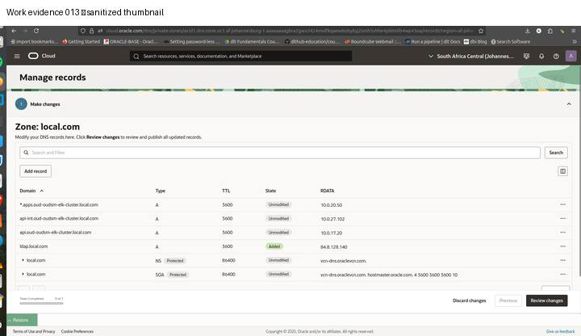

### Evidence 014

- Source: `Screenshot from 2026-07-28 22-39-07.png`
- Category: DNS, load balancers, OUDSM and terminal checks
- SHA-256: `9efd5ffe50675595577947324a6c0e061addfa7c7045c9ddb9e5b15a3644d701`

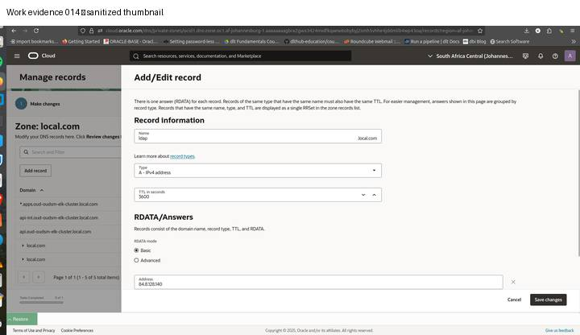

### Evidence 015

- Source: `Screenshot from 2026-07-28 22-39-10.png`
- Category: DNS, load balancers, OUDSM and terminal checks
- SHA-256: `eec072f793accb22846ca96e621e63353e6fcf6419e0ca4cc7c4cf115b4ab599`

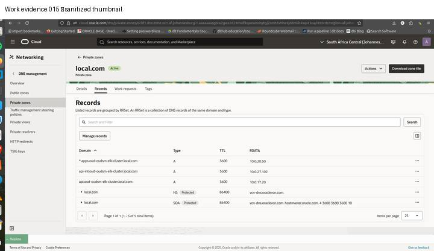

### Evidence 016

- Source: `Screenshot from 2026-07-28 22-39-12.png`
- Category: DNS, load balancers, OUDSM and terminal checks
- SHA-256: `c9e10eb05d43c03e59a8392893c1932db647293e990454e1620fb55bf5a1b2f8`

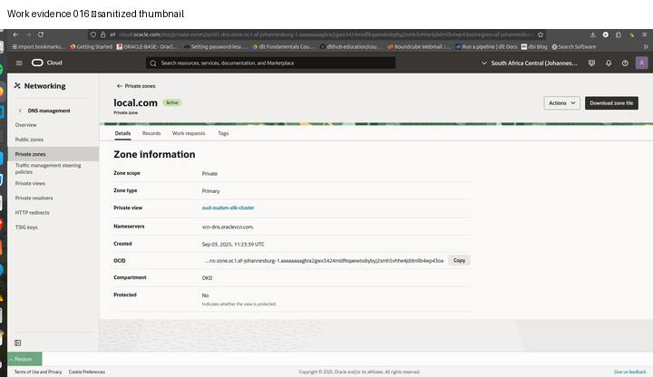

### Evidence 017

- Source: `Screenshot from 2026-07-28 22-39-25.png`
- Category: DNS, load balancers, OUDSM and terminal checks
- SHA-256: `6792a2f02ff12a97528fceafd9f2da31ec935afe3b25ff200abe28f20df65599`

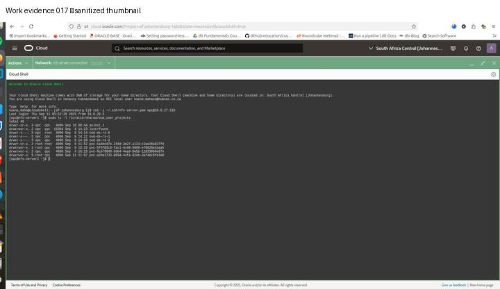

### Evidence 018

- Source: `Screenshot from 2026-07-28 22-39-34.png`
- Category: DNS, load balancers, OUDSM and terminal checks
- SHA-256: `75cd6eadead50305839336975ff2c6f24a255b019375775e99f79f8f26a7aabc`

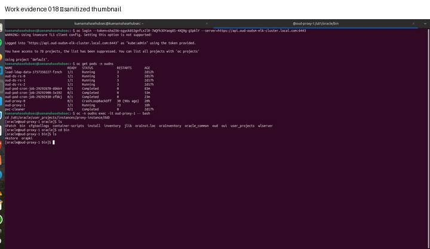

### Evidence 019

- Source: `Screenshot from 2026-07-28 22-39-38.png`
- Category: DNS, load balancers, OUDSM and terminal checks
- SHA-256: `5eba38ee981eb1403f437e18110688f4e72c5aa04577d54d798582d51538576d`

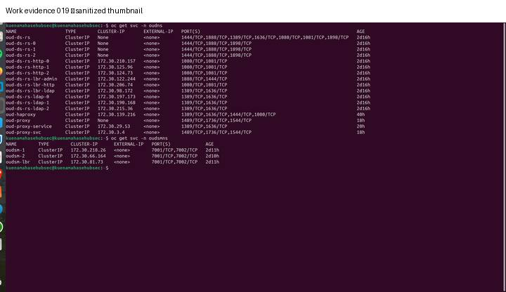

### Evidence 020

- Source: `Screenshot from 2026-07-28 22-40-47.png`
- Category: DNS, load balancers, OUDSM and terminal checks
- SHA-256: `eaa6c392d335679471b4d92f681effab58dae840be43f1f2599ae2cdc019208e`

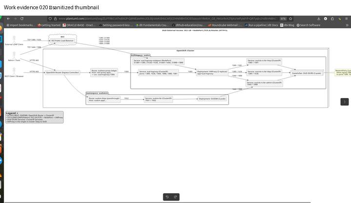

### Evidence 021

- Source: `Screenshot from 2026-07-28 22-41-09.png`
- Category: OCI compute, NFS host and architecture discovery
- SHA-256: `976ce9a69e104af209c69e225243a72275e1f1e036803612cc93bbc13073a7ff`

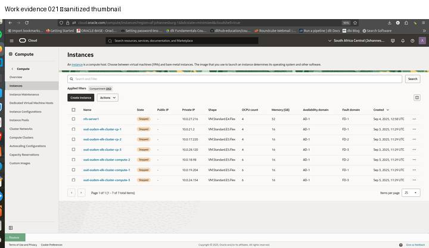

### Evidence 022

- Source: `Screenshot from 2026-07-28 22-41-18.png`
- Category: OCI compute, NFS host and architecture discovery
- SHA-256: `7b82e68106896af5d502da7fb014b7c0df42607ac8ede5b5a134f13c5ec1794b`

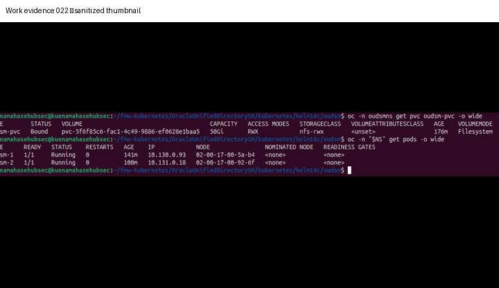

### Evidence 023

- Source: `Screenshot from 2026-07-28 22-41-27.png`
- Category: OCI compute, NFS host and architecture discovery
- SHA-256: `1cb7eeb2ef0e1948aea367e7bf4bf1064fcfeadfb5732663ed9dd28035d6a8b4`

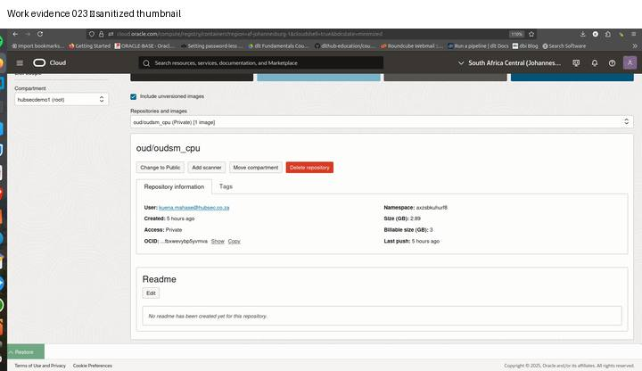

### Evidence 024

- Source: `Screenshot from 2026-07-28 22-41-32.png`
- Category: OCI compute, NFS host and architecture discovery
- SHA-256: `92815a8a5423dcfd6a4fb90900399a4b97b2f85b98c2c6a850721b90713705c0`

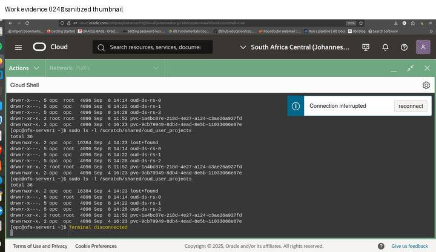

### Evidence 025

- Source: `Screenshot from 2026-07-28 22-41-35.png`
- Category: OCI compute, NFS host and architecture discovery
- SHA-256: `f1930b8e0ac630f1e003065d81d3b96832050903815fcee74a27bcc8e0299ccb`

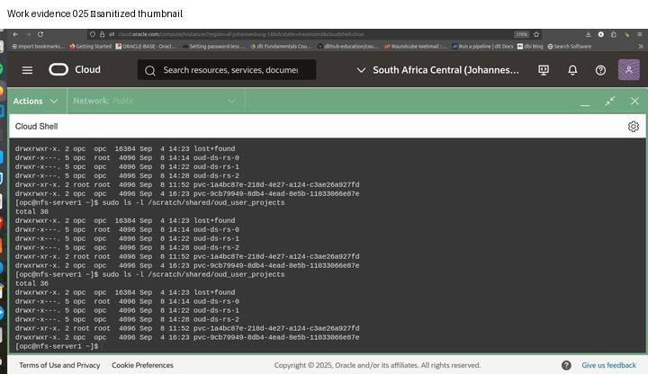

### Evidence 026

- Source: `Screenshot from 2026-07-28 22-41-41.png`
- Category: OCI compute, NFS host and architecture discovery
- SHA-256: `9dab04b42df1c250a9b0169ff3b3aff6b647eae88073424c2131afe8801200e8`

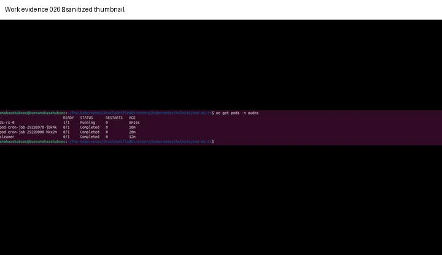

### Evidence 027

- Source: `Screenshot from 2026-07-28 22-41-50.png`
- Category: OCI compute, NFS host and architecture discovery
- SHA-256: `56c157bd967cfa5a413ad0d9eba3d96f58a8bd26965d7a2d857c1be20781b2e6`

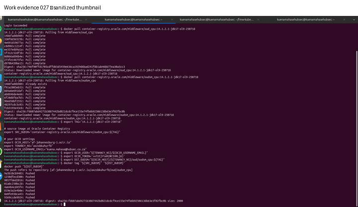

### Evidence 028

- Source: `Screenshot from 2026-07-28 22-41-54.png`
- Category: OCI compute, NFS host and architecture discovery
- SHA-256: `f45c09433049ce3f9fa99c52362c215b96453d7962689958701bc8d3d76248ec`

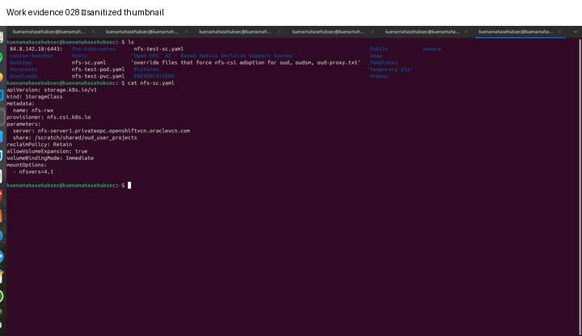

### Evidence 029

- Source: `Screenshot from 2026-07-28 22-42-02.png`
- Category: OCI compute, NFS host and architecture discovery
- SHA-256: `fc9e29730884996938b0f072024243c8c8fc10b4be387d88050c64bf6d190e97`

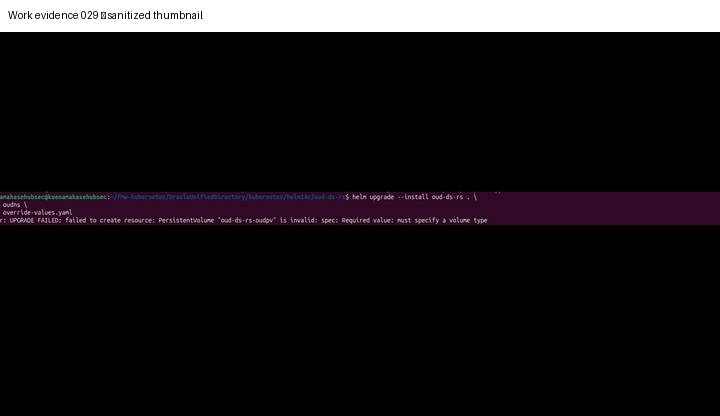

### Evidence 030

- Source: `Screenshot from 2026-07-28 22-42-10.png`
- Category: OCI compute, NFS host and architecture discovery
- SHA-256: `85503085de8f9972cf9a9aaa07e924fc14ca370e48e29b2b3b782993dc8e6481`

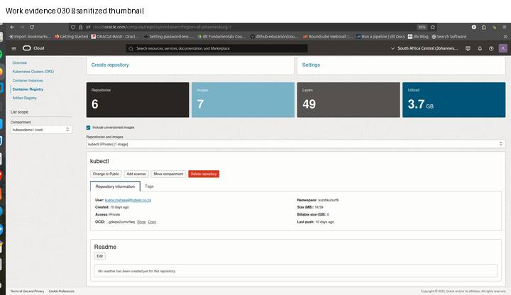

### Evidence 031

- Source: `Screenshot from 2026-07-28 22-42-18.png`
- Category: OCI compute, NFS host and architecture discovery
- SHA-256: `c88d6caa5827657da2f87215f3e8a3c2be068b215562fa42e186a086273c07e5`

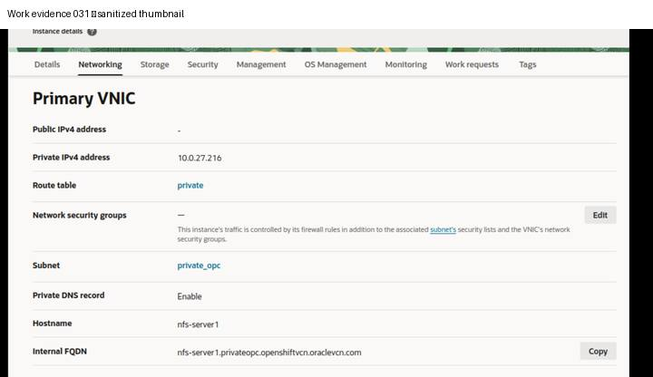

### Evidence 032

- Source: `Screenshot from 2026-07-28 22-42-20.png`
- Category: OCI compute, NFS host and architecture discovery
- SHA-256: `58d6f7e9769054b4b2e9959b12dd718b762cc09fbc190ba263c223617655710e`

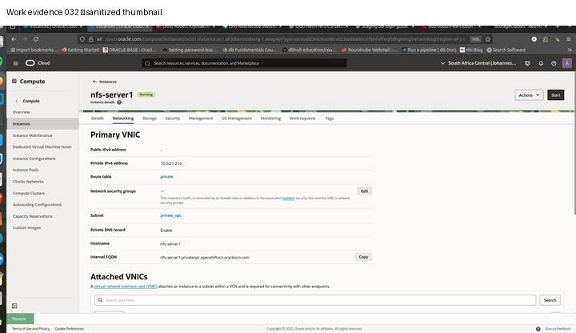

### Evidence 033

- Source: `Screenshot from 2026-07-28 22-42-26.png`
- Category: OCI compute, NFS host and architecture discovery
- SHA-256: `ff56301c850705b7f08e262c1dd9439eef06f0ac56fc71535238b3497ff34705`

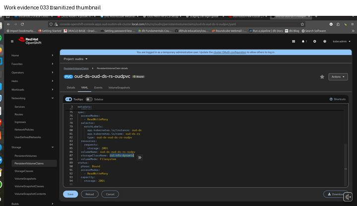

### Evidence 034

- Source: `Screenshot from 2026-07-28 22-42-30.png`
- Category: OCI compute, NFS host and architecture discovery
- SHA-256: `751e4782a7d4a60d58cfda3ae8fd8ddf8e88583ca7ee0f4c8e0da82e0824cadf`

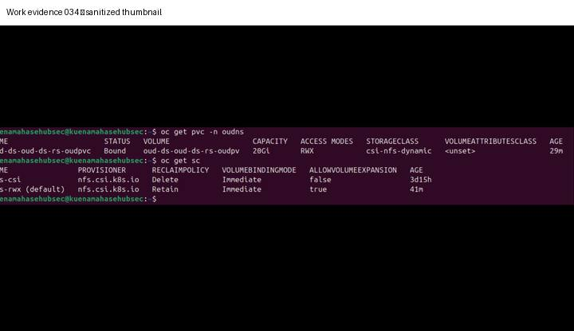

### Evidence 035

- Source: `Screenshot from 2026-07-28 22-42-34.png`
- Category: OCI compute, NFS host and architecture discovery
- SHA-256: `9b4a48d0f1cd5ba798128b1cdeadb89852b1ff5a439234e219c0614dfd72018e`

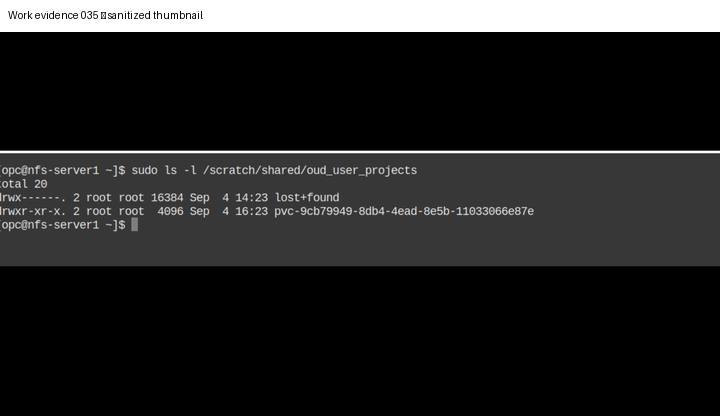

### Evidence 036

- Source: `Screenshot from 2026-07-28 22-42-39.png`
- Category: OCI compute, NFS host and architecture discovery
- SHA-256: `5a565cdbfd228621df7ab3541a459245553964d98544716008cc4b1337e4b039`

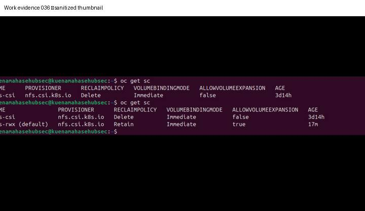

### Evidence 037

- Source: `Screenshot from 2026-07-28 22-42-43.png`
- Category: OCI compute, NFS host and architecture discovery
- SHA-256: `41b4bda5ef5233900c691a522cb30ba2d81b5f430ce9145fc769ea89934bc0d8`

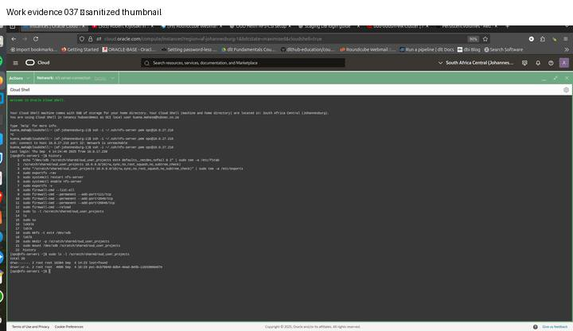

### Evidence 038

- Source: `Screenshot from 2026-07-28 22-42-48.png`
- Category: OCI compute, NFS host and architecture discovery
- SHA-256: `04c96dd759e40b1359f682b1c7405ff8614ce09b51a2283f162af53791e6fb4a`

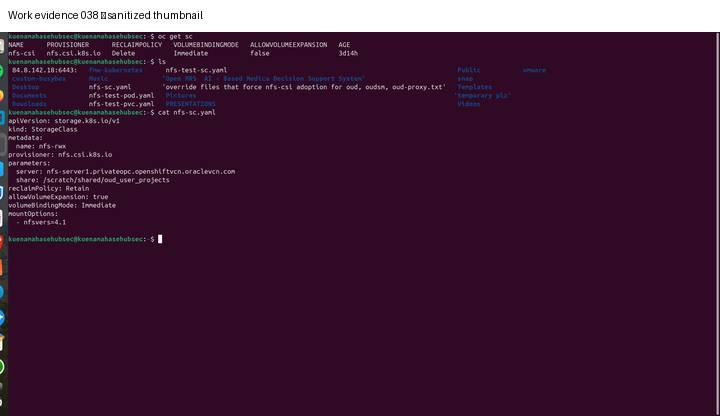

### Evidence 039

- Source: `Screenshot from 2026-07-28 22-42-53.png`
- Category: OCI compute, NFS host and architecture discovery
- SHA-256: `3b41485288fca2763f5056fb47d8318def2b17a33a7a7849e739fc3d255cd832`

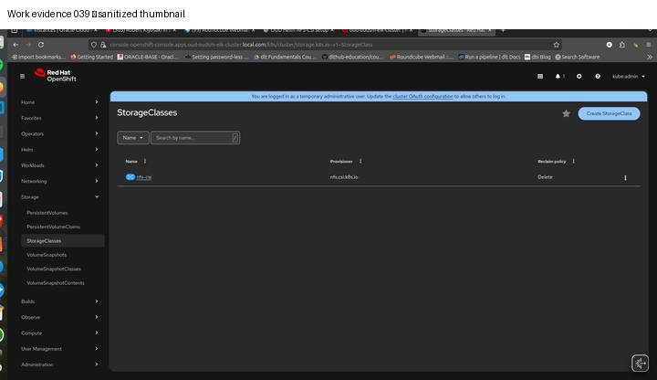

### Evidence 040

- Source: `Screenshot from 2026-07-28 22-43-05.png`
- Category: OCI compute, NFS host and architecture discovery
- SHA-256: `fcb970de1a16804231b1f52d18a965dbec05220c5eb509b6455902e250831610`

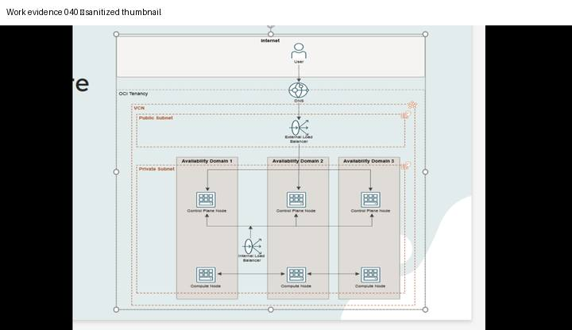

### Evidence 041

- Source: `Screenshot from 2026-07-28 22-43-17.png`
- Category: OCI compute, NFS host and architecture discovery
- SHA-256: `614ee56f13c50acd3ec94d361924a1e04e90881526e41dbaa308f49f50a1c585`

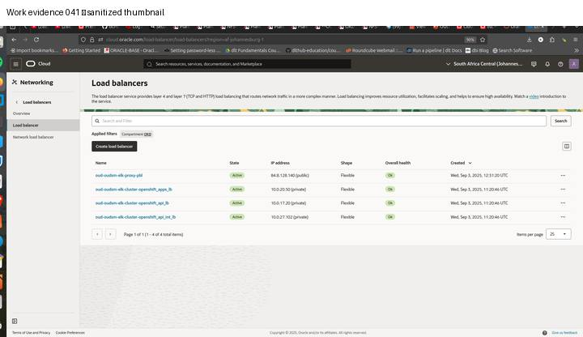

### Evidence 042

- Source: `Screenshot from 2026-07-28 22-43-21.png`
- Category: OCI compute, NFS host and architecture discovery
- SHA-256: `1cdf3595e8dc548bc4167c5c2210d673b84ec46cfbb48921887e4d35ec9d9163`

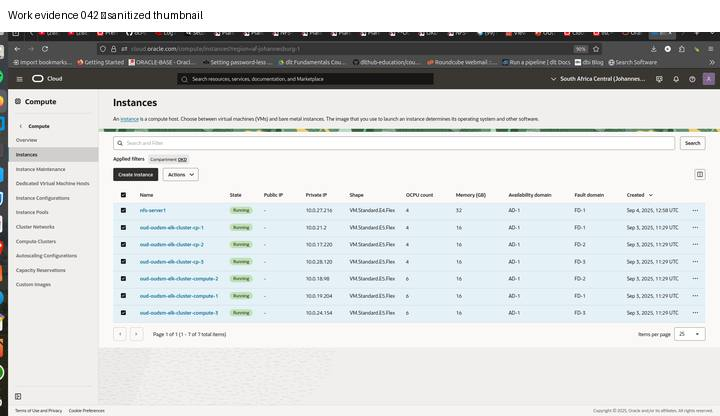

### Evidence 043

- Source: `Screenshot from 2026-07-28 22-43-36.png`
- Category: OCI compute, NFS host and architecture discovery
- SHA-256: `8351dac36cafec8b4f0fccaa127b035f8540e4a6c5da9221c95a16b720e1d718`

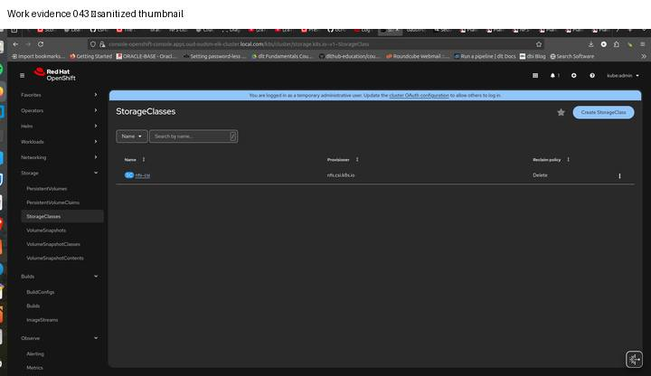

### Evidence 044

- Source: `Screenshot from 2026-07-28 22-43-41.png`
- Category: OCI compute, NFS host and architecture discovery
- SHA-256: `cde3fe68eddf50cca9785c28df7c68d758e7cc899b06b6b5252fc2ffdd20f905`

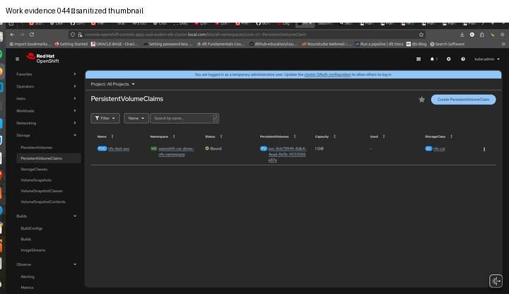

### Evidence 045

- Source: `Screenshot from 2026-07-28 22-43-48.png`
- Category: OCI compute, NFS host and architecture discovery
- SHA-256: `a329ae8ff86abab23974edc027cca8074658c45bc9a4a798a0053ab2b5dd2ca0`

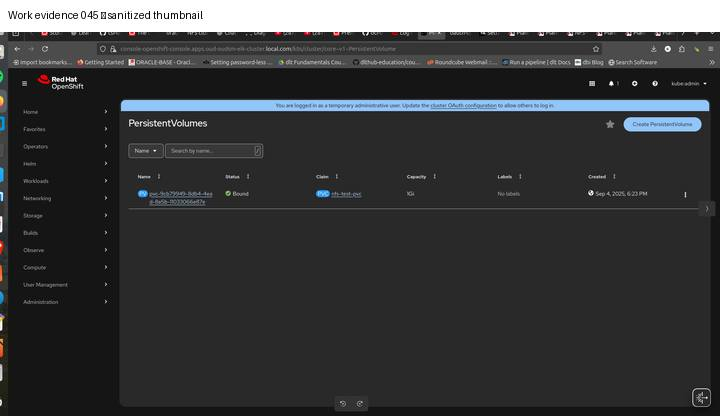

### Evidence 046

- Source: `Screenshot from 2026-07-28 22-43-51.png`
- Category: OCI compute, NFS host and architecture discovery
- SHA-256: `9d9348e9e61e6e2890736e32352b30332035dd7ade82b8878066b9abe0380724`

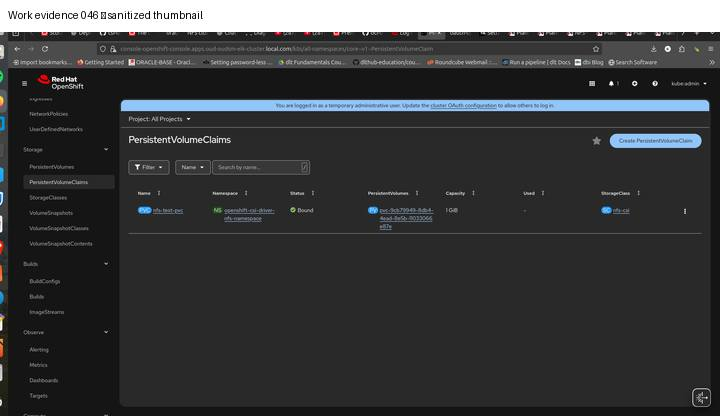

### Evidence 047

- Source: `Screenshot from 2026-07-28 22-44-06.png`
- Category: NFS CSI, storage and backend health
- SHA-256: `e3acd66978ef5a486eff1a9f2ebeb6c498eda8bddd7e0ebfdfef278f811fd31e`

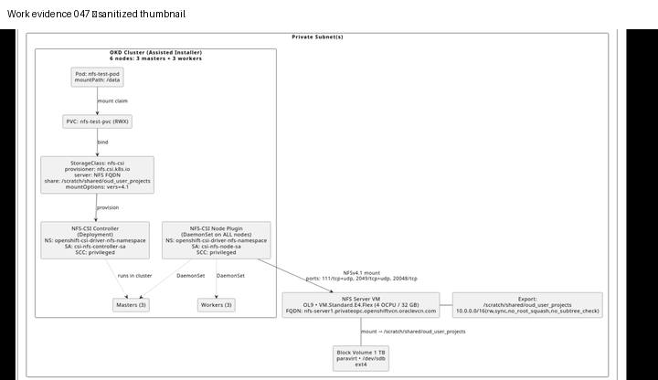

### Evidence 048

- Source: `Screenshot from 2026-07-28 22-44-12.png`
- Category: NFS CSI, storage and backend health
- SHA-256: `998e50bec7e7c4f5e74a9fedb04186e8f207dab2092de768cf0bf903f5751802`

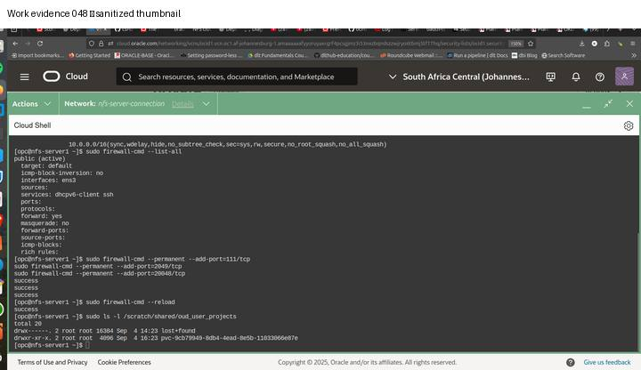

### Evidence 049

- Source: `Screenshot from 2026-07-28 22-44-15.png`
- Category: NFS CSI, storage and backend health
- SHA-256: `4efebde9097a1ee57313abd7318fbaa460ed539d7e4028fe3bb0cf73b06c6ef6`

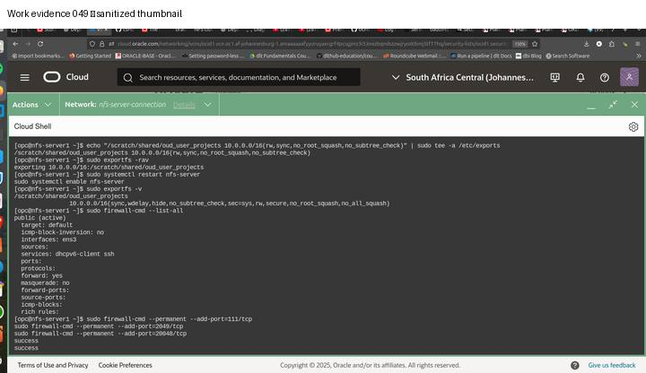

### Evidence 050

- Source: `Screenshot from 2026-07-28 22-44-19.png`
- Category: NFS CSI, storage and backend health
- SHA-256: `eb1c1176e559a397718dae2bf9bdf536f433079854483456d762d7043247ec82`

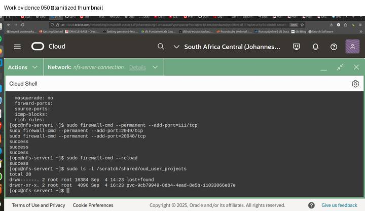

### Evidence 051

- Source: `Screenshot from 2026-07-28 22-44-26.png`
- Category: NFS CSI, storage and backend health
- SHA-256: `933e52da289294c1b1083fca626902a9f3c2b0cd4f2dd77563ffe1fada8982c6`

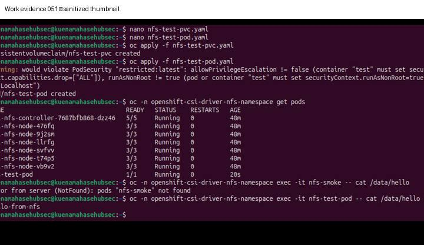

### Evidence 052

- Source: `Screenshot from 2026-07-28 22-44-30.png`
- Category: NFS CSI, storage and backend health
- SHA-256: `c52e94a7ac37f6867fb2a327bbea6ddb829275c0eefa39ce04d0a3d728438f82`

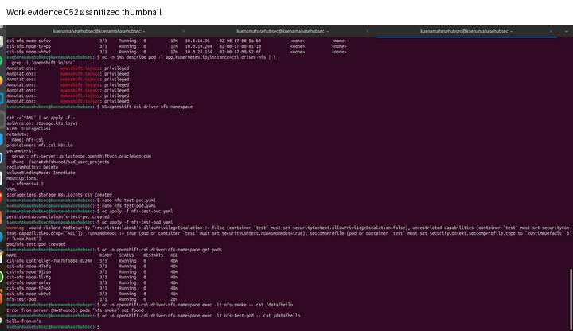

### Evidence 053

- Source: `Screenshot from 2026-07-28 22-44-32.png`
- Category: NFS CSI, storage and backend health
- SHA-256: `0b4c7021f2bc48e95dd0f43a5586e8e791a581aada6dbe1bb57298404b23dcd9`

### Evidence 054

- Source: `Screenshot from 2026-07-28 22-44-36.png`
- Category: NFS CSI, storage and backend health
- SHA-256: `252975931f0a38c7e25ea49d76229b1eb564286c56c08656af147ed4c8250c7c`

### Evidence 055

- Source: `Screenshot from 2026-07-28 22-44-42.png`
- Category: NFS CSI, storage and backend health
- SHA-256: `b57c9e0ed95dc2577cf05058efd8b1aeb822a8ac5fbc853f9e0d1af1214c8a7b`

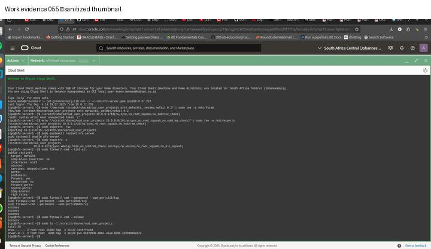

### Evidence 056

- Source: `Screenshot from 2026-07-28 22-44-46.png`
- Category: NFS CSI, storage and backend health
- SHA-256: `9ac25b7b9a3402fd816a52a62835b1a05f563eaa0ea870ea62355ce05765603d`

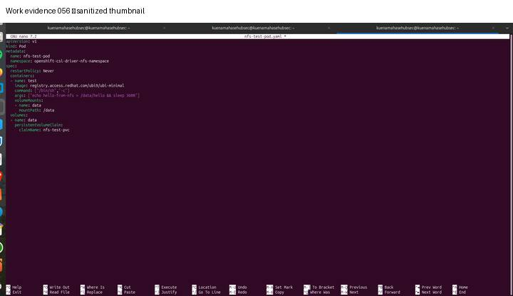

### Evidence 057

- Source: `Screenshot from 2026-07-28 22-44-50.png`
- Category: NFS CSI, storage and backend health
- SHA-256: `8ef858f20666fda2fb750ca7005ec5b399fc73853266e7389b14fead4cb5d597`

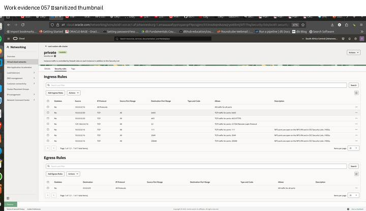

### Evidence 058

- Source: `Screenshot from 2026-07-28 22-44-53.png`
- Category: NFS CSI, storage and backend health
- SHA-256: `a4b85256d4013d7b032a0843bdb5be5d7595190e4f4ec51cf6c94179ff89d9df`

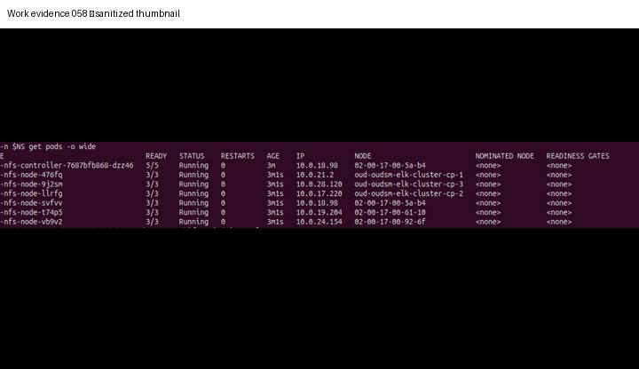

### Evidence 059

- Source: `Screenshot from 2026-07-28 22-44-57.png`
- Category: NFS CSI, storage and backend health
- SHA-256: `51d524a29a81ac92ab80a1f7f0bfe0774c0d19184f259d0b1d2e0793042e2b7a`

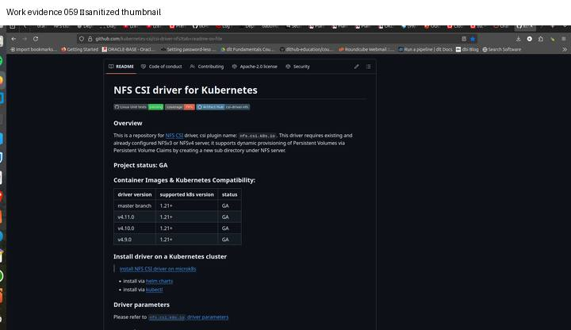

### Evidence 060

- Source: `Screenshot from 2026-07-28 22-45-01.png`
- Category: NFS CSI, storage and backend health
- SHA-256: `c0798371ffc5a98f976dbad145e83a2495d38e85402f0c7a0f340ed4ce3b4783`

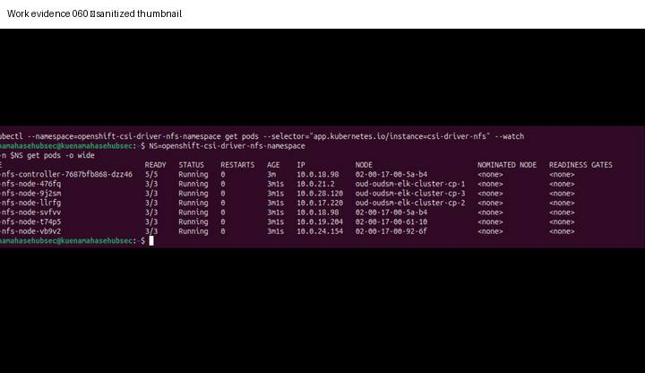

### Evidence 061

- Source: `Screenshot from 2026-07-28 22-45-06.png`
- Category: NFS CSI, storage and backend health
- SHA-256: `13c3d9cdfd24850646cf6ab0458aeada88e7c7290b953a14a9f73850e8a80ccc`

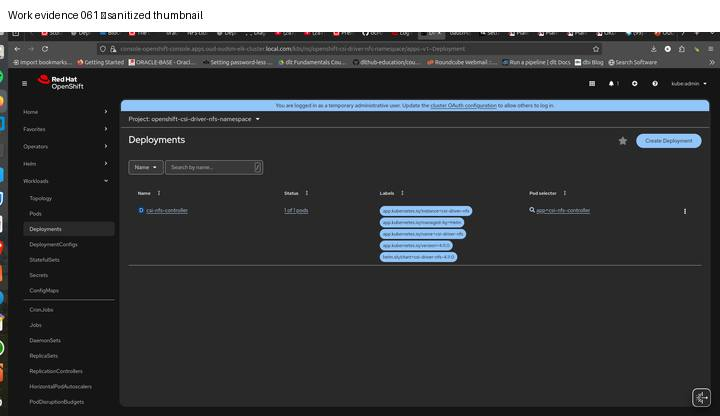

### Evidence 062

- Source: `Screenshot from 2026-07-28 22-45-16.png`
- Category: NFS CSI, storage and backend health
- SHA-256: `a0b693d84df898c67c3402ba67360b57d4cf3c7c8a89bcc14f7453c47d77e9ec`

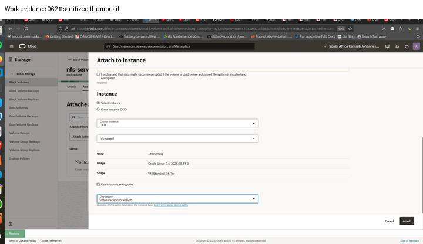

### Evidence 063

- Source: `Screenshot from 2026-07-28 22-45-21.png`
- Category: NFS CSI, storage and backend health
- SHA-256: `3b93607a87e2805b8c50cbe365c4876ddeb0b8396eb57a84123cf3d09b8acf2a`

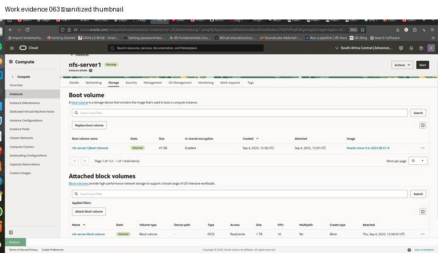

### Evidence 064

- Source: `Screenshot from 2026-07-28 22-45-35.png`
- Category: NFS CSI, storage and backend health
- SHA-256: `6603779fa82424ade4cc079e7ecbfda3a27cc42bfb59b420f6b7369423a8a33d`

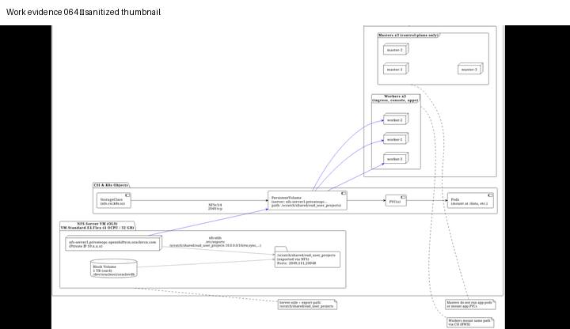

### Evidence 065

- Source: `Screenshot from 2026-07-28 22-45-45.png`
- Category: NFS CSI, storage and backend health
- SHA-256: `6932b72977cffbadb3fbfe00a5b63515f2f2b91ea917d42ff5367ae515ad17d3`

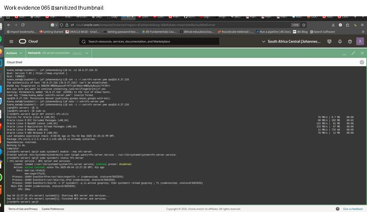

### Evidence 066

- Source: `Screenshot from 2026-07-28 22-45-48.png`
- Category: NFS CSI, storage and backend health
- SHA-256: `cf24b8c55584405d1de184ee095cfaacfede6c37c599e27c79306a64dc792800`

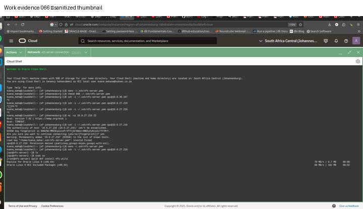

### Evidence 067

- Source: `Screenshot from 2026-07-28 22-45-56.png`
- Category: NFS CSI, storage and backend health
- SHA-256: `d199dcc64cfa92759d7220a8a59430daacb6922d317c830d78ad4bfc1a965bfe`

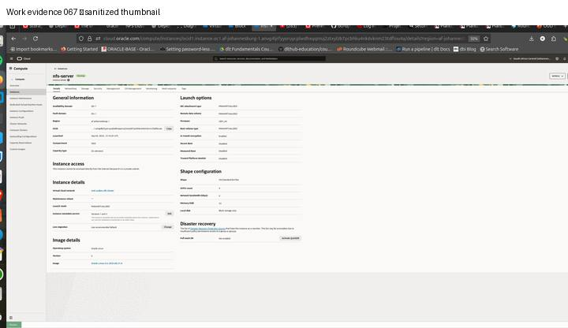

### Evidence 068

- Source: `Screenshot from 2026-07-28 22-46-03.png`
- Category: NFS CSI, storage and backend health
- SHA-256: `d72e45953b2afae5b15a94080560aff4a4efa8ec0ecc18b41f2173ef3cde1d78`

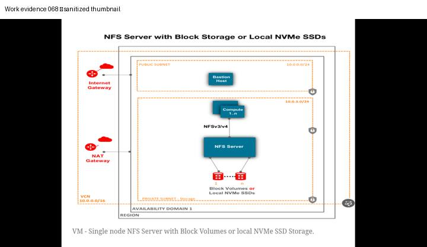

### Evidence 069

- Source: `Screenshot from 2026-07-28 22-46-09.png`
- Category: NFS CSI, storage and backend health
- SHA-256: `78acbbffee3cc4257bb2dfa2deb1fc5565a04c022d71bd0879cf7d78f89f539a`

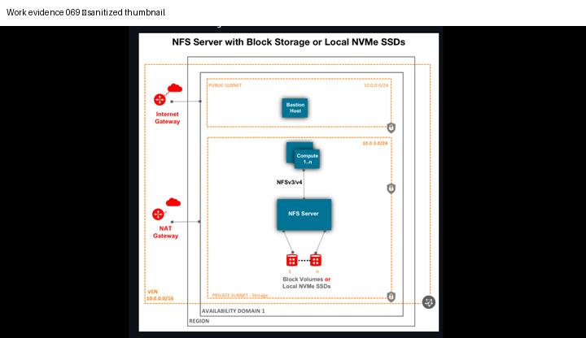

### Evidence 070

- Source: `Screenshot from 2026-07-28 22-46-20.png`
- Category: NFS CSI, storage and backend health
- SHA-256: `2b7a3e1754a44993ac63ec96f66b794048e653406ef8d0e7d8ee17f807fd96c2`

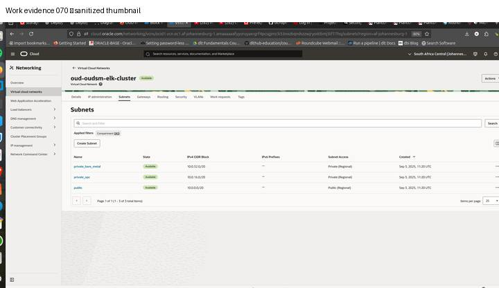

### Evidence 071

- Source: `Screenshot from 2026-07-28 22-46-24.png`
- Category: NFS CSI, storage and backend health
- SHA-256: `94e98dcbc6883631cc0cd1940158d556fde584e300d1e661a0bec5ead811a074`

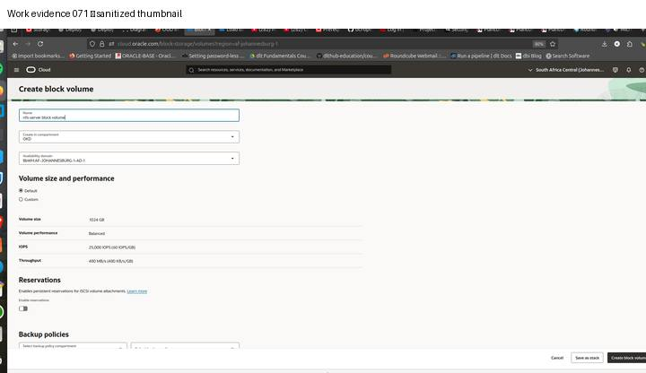

### Evidence 072

- Source: `Screenshot from 2026-07-28 22-46-32.png`
- Category: NFS CSI, storage and backend health
- SHA-256: `4ba8b6a483a66d63a2c14122659398ea74cea1c35bd594be37af27ed2a1f7ee2`

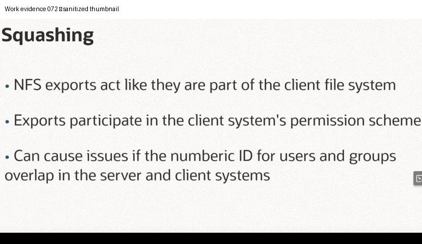

### Evidence 073

- Source: `Screenshot from 2026-07-28 22-46-35.png`
- Category: NFS CSI, storage and backend health
- SHA-256: `7e344e64193b80a597c6dc5b4344c91ed35cfba33e5f3065a4426e800aa23cb8`

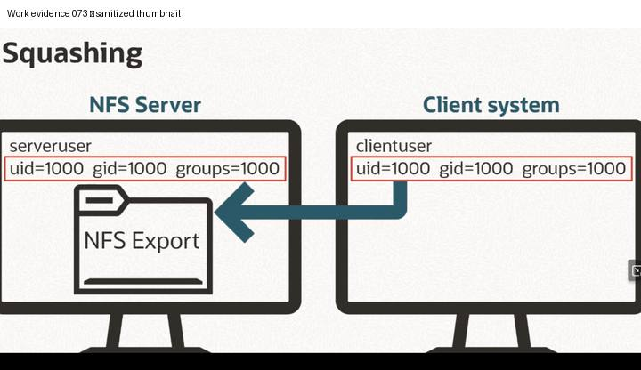

### Evidence 074

- Source: `Screenshot from 2026-07-28 22-46-49.png`
- Category: NFS CSI, storage and backend health
- SHA-256: `b41a4bbf9b673827f1537d8c103c0ee297ea757053caa9f7926f11b31c3da099`

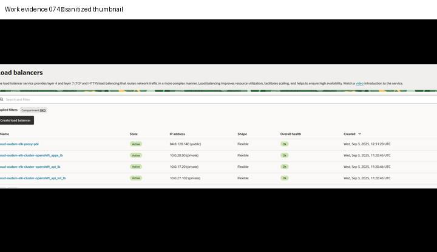

### Evidence 075

- Source: `Screenshot from 2026-07-28 22-46-51.png`
- Category: NFS CSI, storage and backend health
- SHA-256: `6a26fb5cd725788aec3537bdbc12d4a5a8476900801768f9c04d1f17cc8044ec`

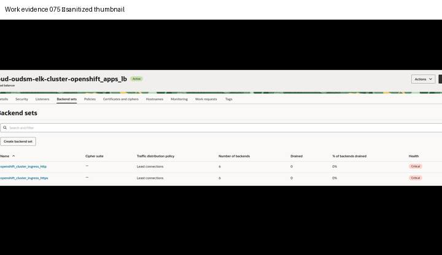

### Evidence 076

- Source: `Screenshot from 2026-07-28 22-46-54.png`
- Category: NFS CSI, storage and backend health
- SHA-256: `76cea5c966d2ac4bf0597e598071265878bb85bdccaa8cbdb41e08f60bde1ca0`

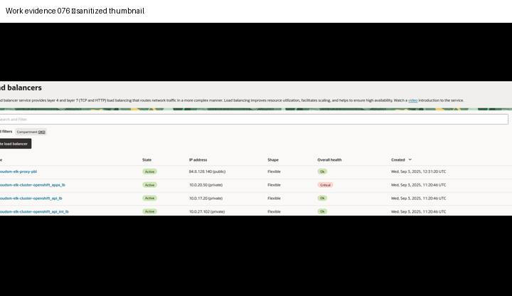

### Evidence 077

- Source: `Screenshot from 2026-07-28 22-47-04.png`
- Category: OCI load balancer and Resource Manager configuration
- SHA-256: `2a70b4415798a27187c26c525ab9359bd24f22a3a8a10f432c3fc8573d129996`

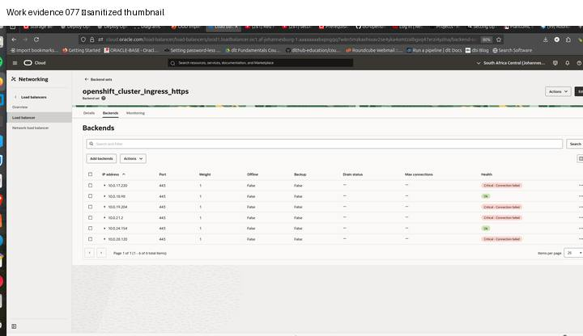

### Evidence 078

- Source: `Screenshot from 2026-07-28 22-47-07.png`
- Category: OCI load balancer and Resource Manager configuration
- SHA-256: `0cd059969bb23a0513282c5f50bd1b479e57dee35843fe5d7e2e5e3fcc07cbb5`

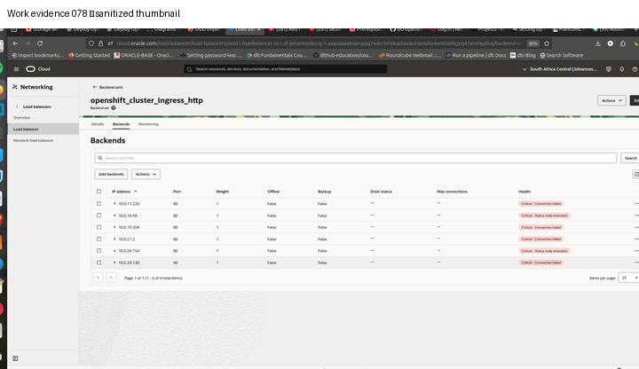

### Evidence 079

- Source: `Screenshot from 2026-07-28 22-47-10.png`
- Category: OCI load balancer and Resource Manager configuration
- SHA-256: `1b4e3e6a5c6928fcda282f6eba33255465eb886b763f37a386110ab78e066294`

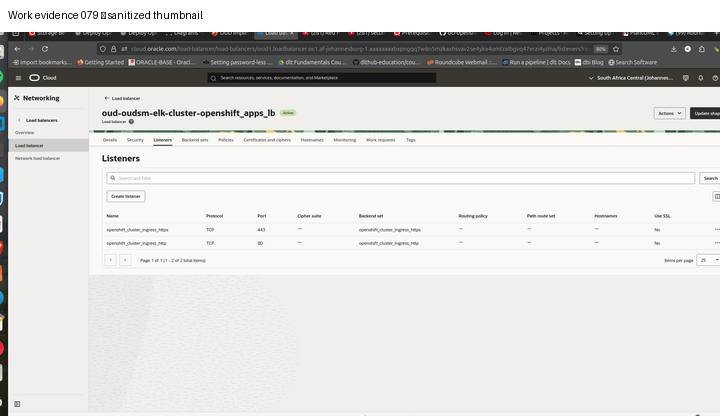

### Evidence 080

- Source: `Screenshot from 2026-07-28 22-47-14.png`
- Category: OCI load balancer and Resource Manager configuration
- SHA-256: `cd40ca495ee50ced2f32df4b111e5197284eb049a87be51c6e883ac15f9f675b`

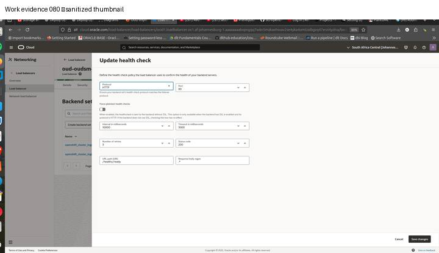

### Evidence 081

- Source: `Screenshot from 2026-07-28 22-47-17.png`
- Category: OCI load balancer and Resource Manager configuration
- SHA-256: `e2d56c1a89b4b6dc7dd6245aa6b1786c324751a5f005c40564e5815a1348365c`

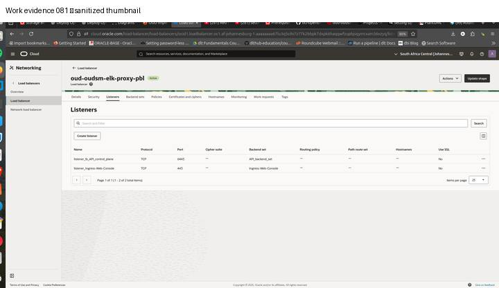

### Evidence 082

- Source: `Screenshot from 2026-07-28 22-47-27.png`
- Category: OCI load balancer and Resource Manager configuration
- SHA-256: `121c2e15a2bb27c316335f2994a386ecb80d5f5fa43f15f976aad4703ba81ade`

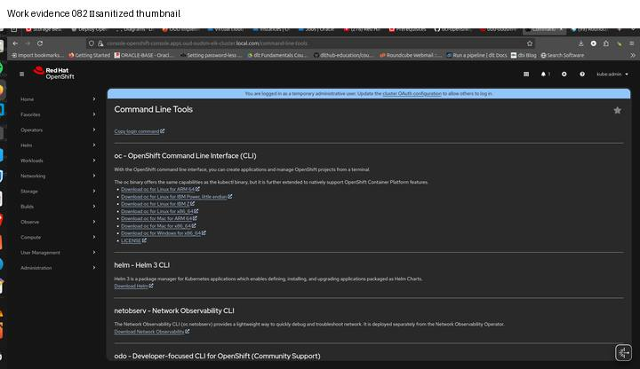

### Evidence 083

- Source: `Screenshot from 2026-07-28 22-47-32.png`
- Category: OCI load balancer and Resource Manager configuration
- SHA-256: `869f437d6fea04102adb218cb0df4b463f3d3a67291aa78e7570fd52932e29a2`

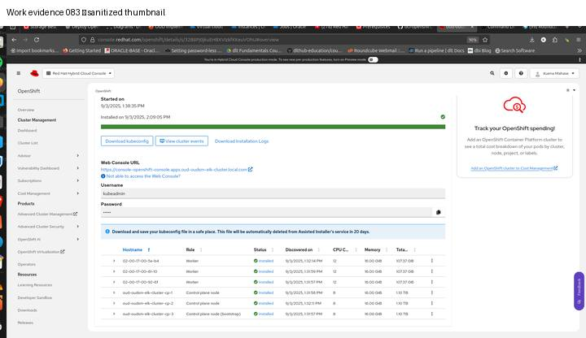

### Evidence 084

- Source: `Screenshot from 2026-07-28 22-47-35.png`
- Category: OCI load balancer and Resource Manager configuration
- SHA-256: `9b4f6ff79e1b793a40844d2453d4ff630837ef564c3bb9d0c4bab5fe579d63ca`

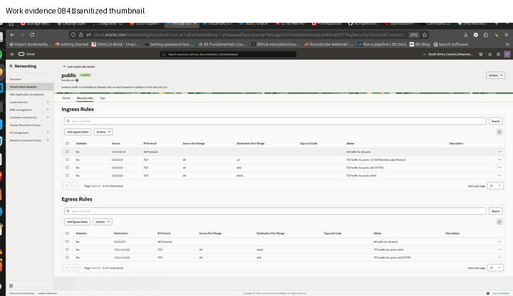

### Evidence 085

- Source: `Screenshot from 2026-07-28 22-47-39.png`
- Category: OCI load balancer and Resource Manager configuration
- SHA-256: `0999430c2639318651c629fdd01b574abc73af51381e71f958a4df4fe27a3db0`

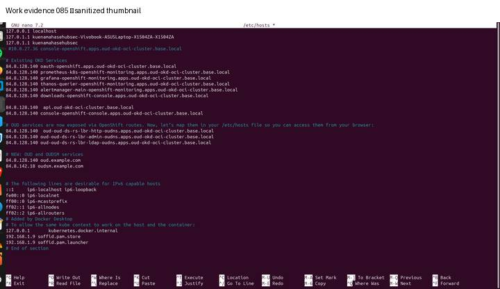

### Evidence 086

- Source: `Screenshot from 2026-07-28 22-47-42.png`
- Category: OCI load balancer and Resource Manager configuration
- SHA-256: `8ef11e8f569791fa7b72713d6602d3d7b5bae687ab9ebc1000908217eb895c95`

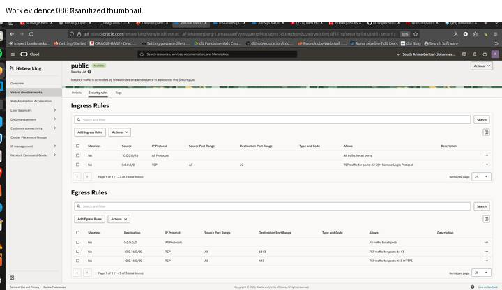

### Evidence 087

- Source: `Screenshot from 2026-07-28 22-47-44.png`
- Category: OCI load balancer and Resource Manager configuration
- SHA-256: `c3b92e03c93b4759419eca8165837b5a6b451237ec3e64c89c2fe34e697e224f`

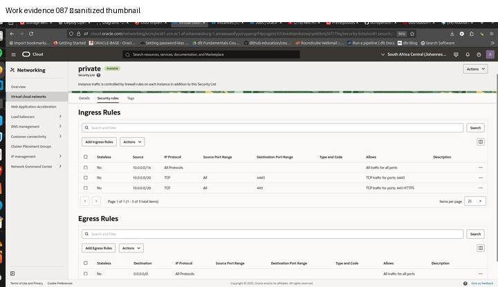

### Evidence 088

- Source: `Screenshot from 2026-07-28 22-47-46.png`
- Category: OCI load balancer and Resource Manager configuration
- SHA-256: `ec289a566b02fd02d0f70316f13d9465352cf1102be034ad8842f0f2e71baa45`

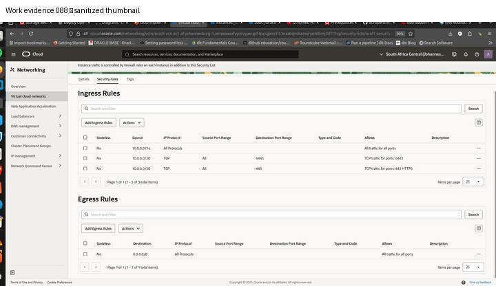

### Evidence 089

- Source: `Screenshot from 2026-07-28 22-47-47.png`
- Category: OCI load balancer and Resource Manager configuration
- SHA-256: `79d8d237403649567386049730bf3729b5f94c8067416c7b254f3f0cad3e29d6`

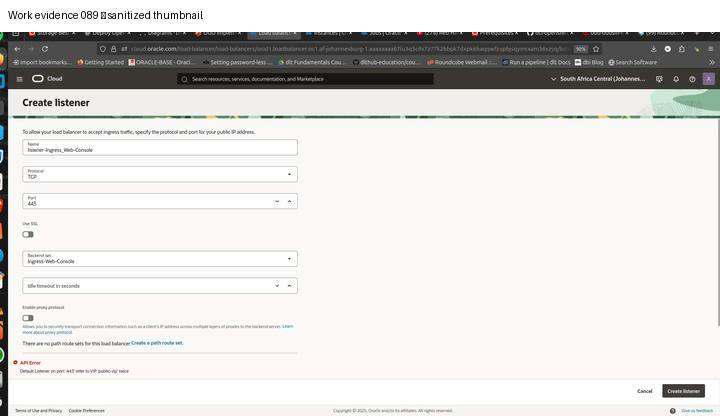

### Evidence 090

- Source: `Screenshot from 2026-07-28 22-47-49.png`
- Category: OCI load balancer and Resource Manager configuration
- SHA-256: `5262c039b07ed6ab5f1a2e68ab4c8fe24357309ffd51c07a51abb0ffa09226e2`

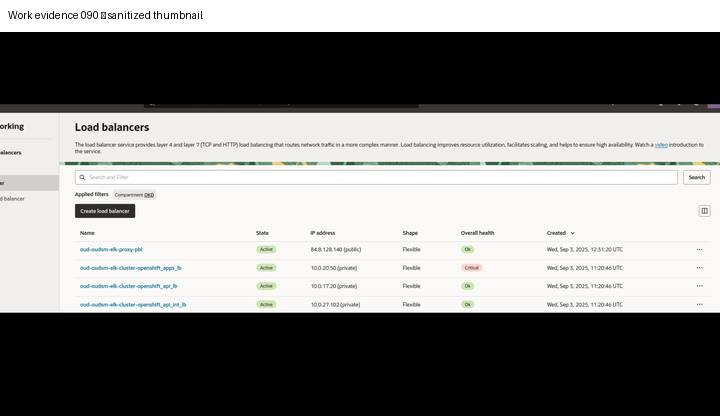

### Evidence 091

- Source: `Screenshot from 2026-07-28 22-47-51.png`
- Category: OCI load balancer and Resource Manager configuration
- SHA-256: `b236028b7eaabec71f27a0875e5f63bc1bdd4f5cfe23297a7a1ce1fcd51dfa50`

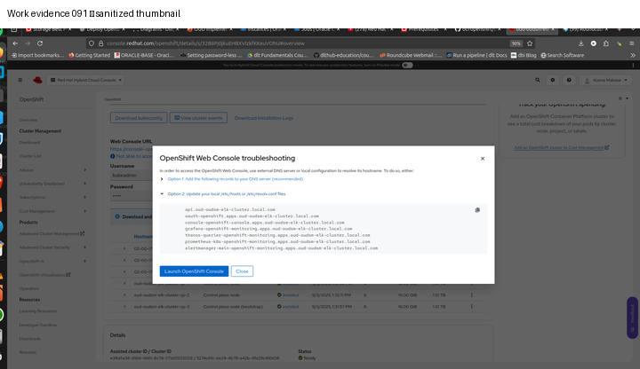

### Evidence 092

- Source: `Screenshot from 2026-07-28 22-47-55.png`
- Category: OCI load balancer and Resource Manager configuration
- SHA-256: `4ce0ab3185cf38d0c1bbe9728bc073acd3580e28720b72fa3d220c668d6debe2`

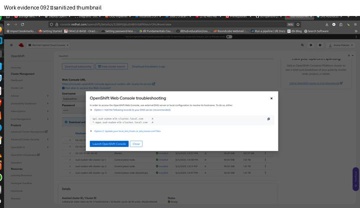

### Evidence 093

- Source: `Screenshot from 2026-07-28 22-48-05.png`
- Category: OCI load balancer and Resource Manager configuration
- SHA-256: `64c5628b56d1fd894ca5bf3f17c7024f497c18a7ae23c529d223325c21cd6304`

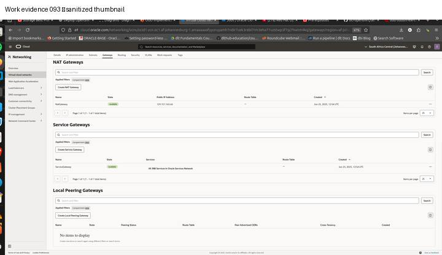

### Evidence 094

- Source: `Screenshot from 2026-07-28 22-48-10.png`
- Category: OCI load balancer and Resource Manager configuration
- SHA-256: `e5cf14ffc34a74dbb9b849de4a8cf95384da0037ad7d57d32d4f77efb7d0628b`

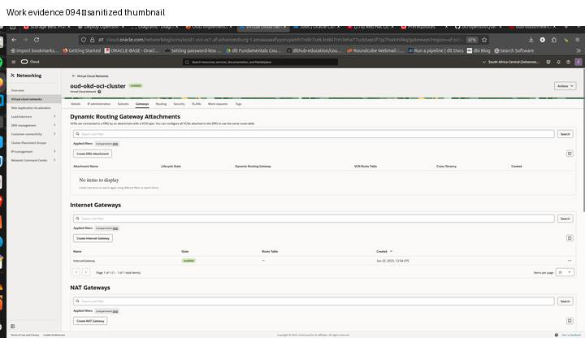

### Evidence 095

- Source: `Screenshot from 2026-07-28 22-48-13.png`
- Category: OCI load balancer and Resource Manager configuration
- SHA-256: `e10de19fea729f6de2b4f02e37b0f61b9138217ddd34b243d6eb102a880d75ee`

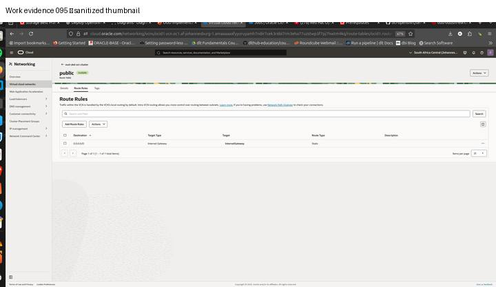

### Evidence 096

- Source: `Screenshot from 2026-07-28 22-48-16.png`
- Category: OCI load balancer and Resource Manager configuration
- SHA-256: `4a7b8ef491d1500cdba36390993c11987bd32dab3167555947205fc635cec76a`

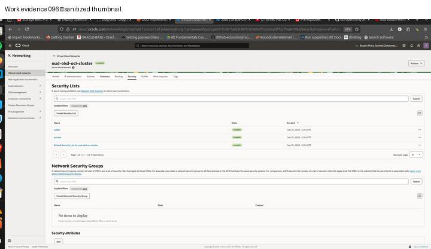

### Evidence 097

- Source: `Screenshot from 2026-07-28 22-48-19.png`
- Category: OCI load balancer and Resource Manager configuration
- SHA-256: `64a95096b067208786dcf2c038426f90ba744add1481cabc10ffeca4230ead4a`

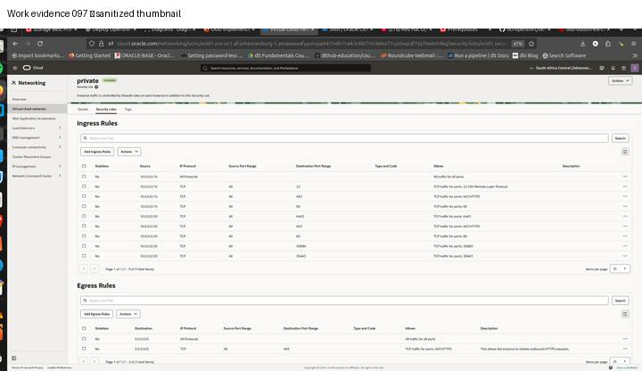

### Evidence 098

- Source: `Screenshot from 2026-07-28 22-48-34.png`
- Category: OCI load balancer and Resource Manager configuration
- SHA-256: `e68b2762b0e09172688abb1666ea7761d8783f46a7bff953caa5e2d8ea17f99e`

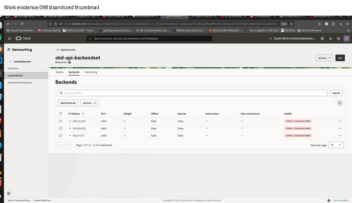

### Evidence 099

- Source: `Screenshot from 2026-07-28 22-48-37.png`
- Category: OCI load balancer and Resource Manager configuration
- SHA-256: `266ac513a553442a24bb53d7259bc923673e5564aa6c8581bb3c07758f4c25a3`

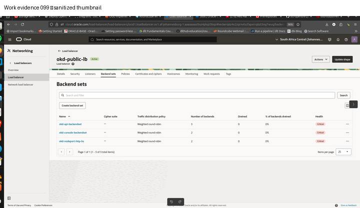

### Evidence 100

- Source: `Screenshot from 2026-07-28 22-48-42.png`
- Category: OCI load balancer and Resource Manager configuration
- SHA-256: `48b435bc0f33f747e3c7e31c946266e0e8efeeb2a2fe934cdf75069c4c7ece92`

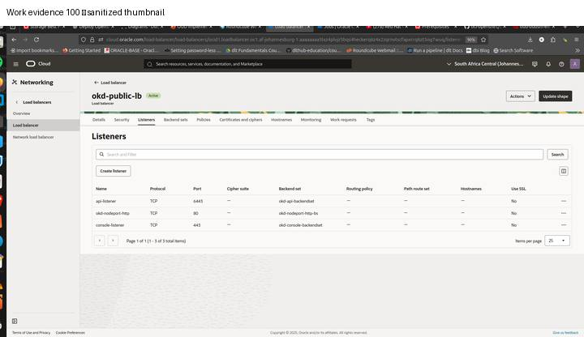

### Evidence 101

- Source: `Screenshot from 2026-07-28 22-48-46.png`
- Category: OCI load balancer and Resource Manager configuration
- SHA-256: `9196ccc36ff295f2722ac1db234b4c13eac03eb7066a9d3dcfd0631d0bb6907c`

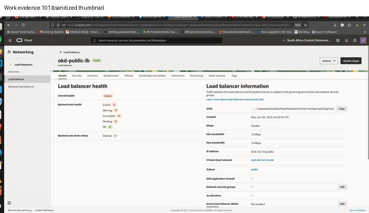

### Evidence 102

- Source: `Screenshot from 2026-07-28 22-48-51.png`
- Category: OCI load balancer and Resource Manager configuration
- SHA-256: `85830df7f8b20429698bc387008d2989cb5458deffe64aefa0d905c5fce6f187`

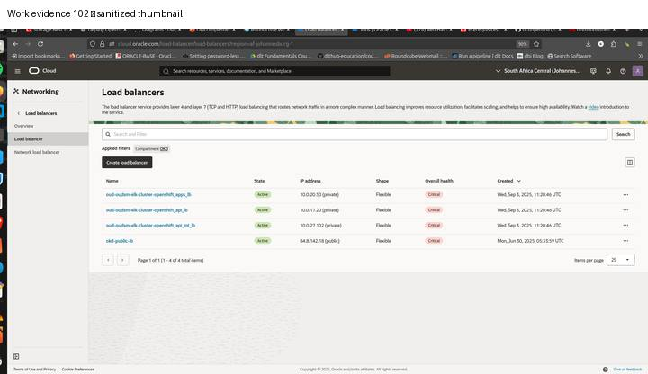

### Evidence 103

- Source: `Screenshot from 2026-07-28 22-48-55.png`
- Category: OCI load balancer and Resource Manager configuration
- SHA-256: `dc077d16aa60fbaea4d3042c331ae4e709fd9014fa7495fa7273ee38fd4e408d`

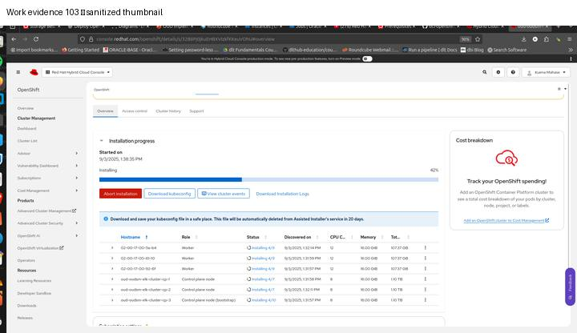

### Evidence 104

- Source: `Screenshot from 2026-07-28 22-48-58.png`
- Category: OCI load balancer and Resource Manager configuration
- SHA-256: `c8dac685a73895ae9a90c3679f4a63d5f24065a3d42740ed7794664cfb4a62a2`

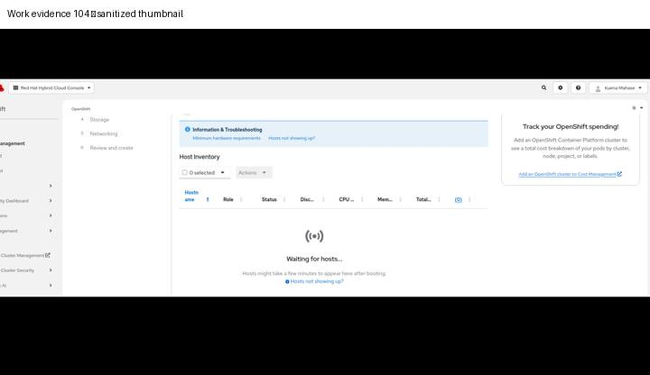

### Evidence 105

- Source: `Screenshot from 2026-07-28 22-49-05.png`
- Category: OUDSM access, topology and platform validation
- SHA-256: `62964a053cae171d300312285f230b689e328eea6ba92d969a43e8b58c842d27`

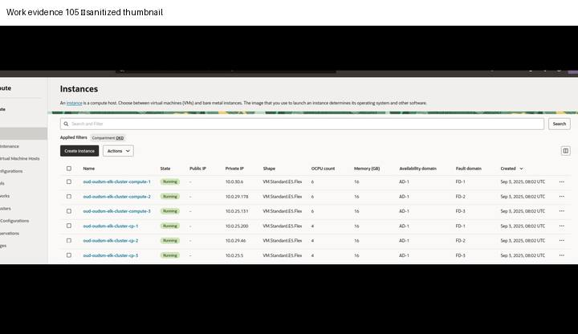

### Evidence 106

- Source: `Screenshot from 2026-07-28 22-49-11.png`
- Category: OUDSM access, topology and platform validation
- SHA-256: `9bd7ce3863b78290375cf78ce57a74935b4caac7b7e6e1874caa910d5b2d90f2`

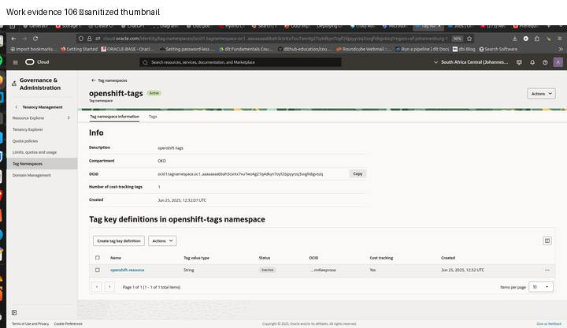

### Evidence 107

- Source: `Screenshot from 2026-07-28 22-49-14.png`
- Category: OUDSM access, topology and platform validation
- SHA-256: `bc8733d4599f92e76e82a37ce96564cb62bea44f3524207e8250b086c25506b9`

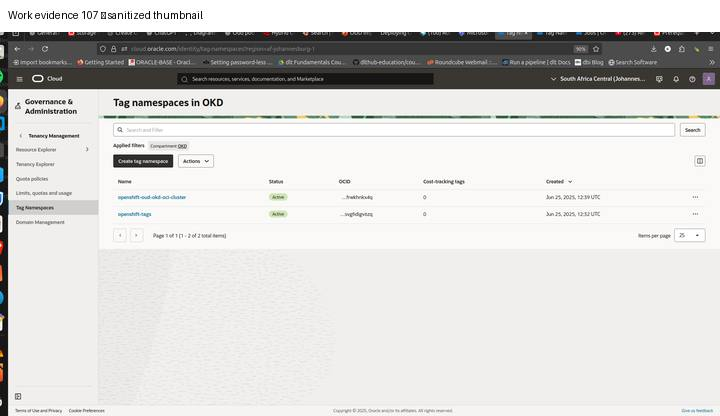

### Evidence 108

- Source: `Screenshot from 2026-07-28 22-49-18.png`
- Category: OUDSM access, topology and platform validation
- SHA-256: `c5f1a05eecd361b4c4c7db07fde28399088c5689b8b584911f48e63108db39d1`

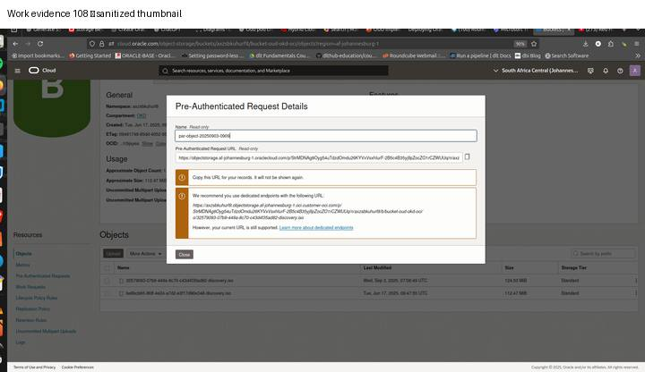

### Evidence 109

- Source: `Screenshot from 2026-07-28 22-49-21.png`
- Category: OUDSM access, topology and platform validation
- SHA-256: `4b756e673e8d3561f0531ec3e8e23009f1caac87a9392bd1bee11b72ad30da71`

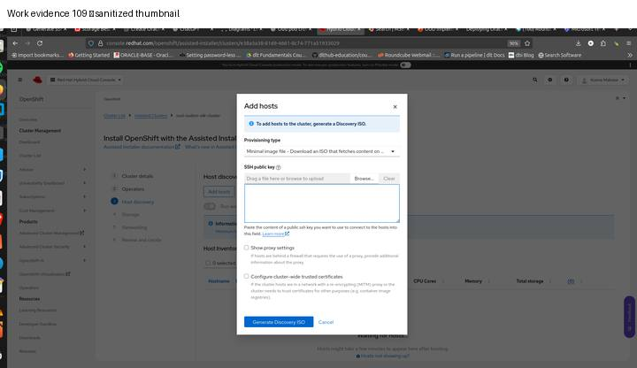

### Evidence 110

- Source: `Screenshot from 2026-07-28 22-49-23.png`
- Category: OUDSM access, topology and platform validation
- SHA-256: `28a5222005f58c7e56f08af40039ff352b654795598abbe061bdb4d05c45b257`

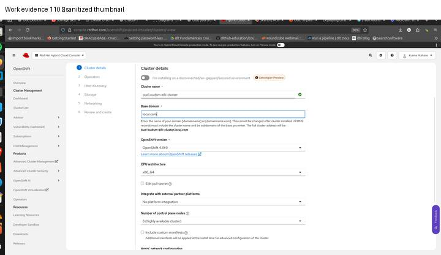

### Evidence 111

- Source: `Screenshot from 2026-07-28 22-49-34.png`
- Category: OUDSM access, topology and platform validation
- SHA-256: `79649d7c608fe94bb4dfcd84985930b97d25853bc91396febda34bb1c1f7ad46`

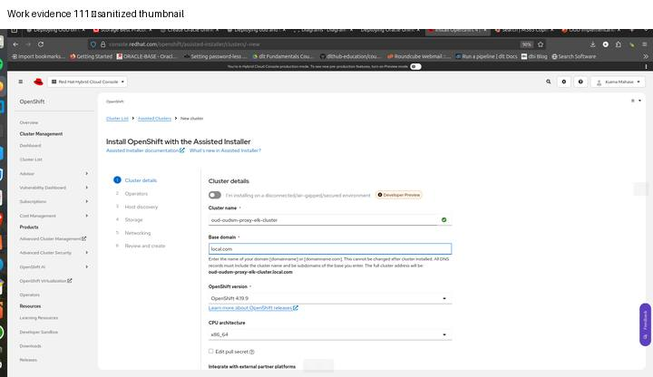

### Evidence 112

- Source: `Screenshot from 2026-07-28 22-49-38.png`
- Category: OUDSM access, topology and platform validation
- SHA-256: `c767381145a2b1b0e84ba784f0cf105c2ce036a1bdc2e9f1f28e01929f7dc86a`

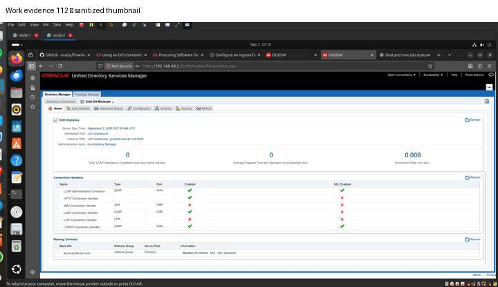

### Evidence 113

- Source: `Screenshot from 2026-07-28 22-49-40.png`
- Category: OUDSM access, topology and platform validation
- SHA-256: `a43f85a26e8470625ccffa1e933c475fdf98026bc9df989f023bbe036b00b304`

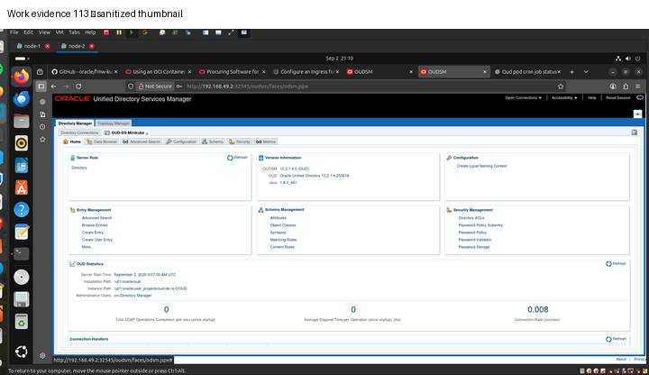

### Evidence 114

- Source: `Screenshot from 2026-07-28 22-49-42.png`
- Category: OUDSM access, topology and platform validation
- SHA-256: `956b63b00a90cebba13c6792ac66dac096f8632adf91bf73773e4eda6048045b`

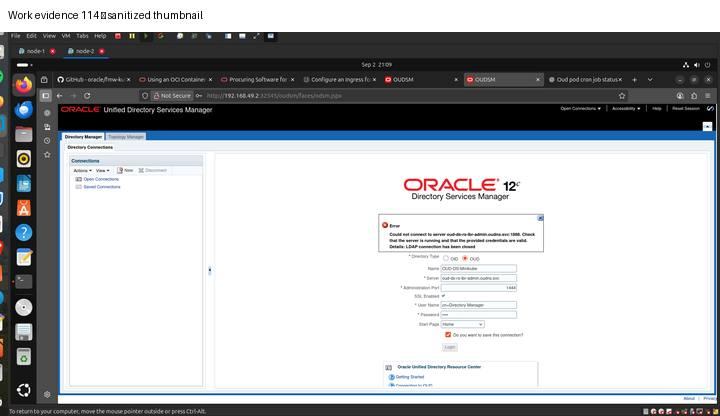

### Evidence 115

- Source: `Screenshot from 2026-07-28 22-49-46.png`
- Category: OUDSM access, topology and platform validation
- SHA-256: `6399ff99859c8fa8dc9c68de88a11cd5e42ffa72ee98a5b3214f7a2765870a02`

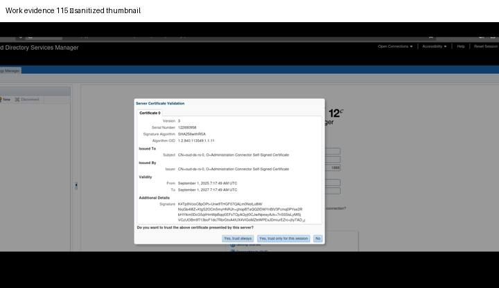

### Evidence 116

- Source: `Screenshot from 2026-07-28 22-49-52.png`
- Category: OUDSM access, topology and platform validation
- SHA-256: `73be9ba861b1fc1e1c54ac920de1d5f3b819c36496c876f917aca4c9ac809743`

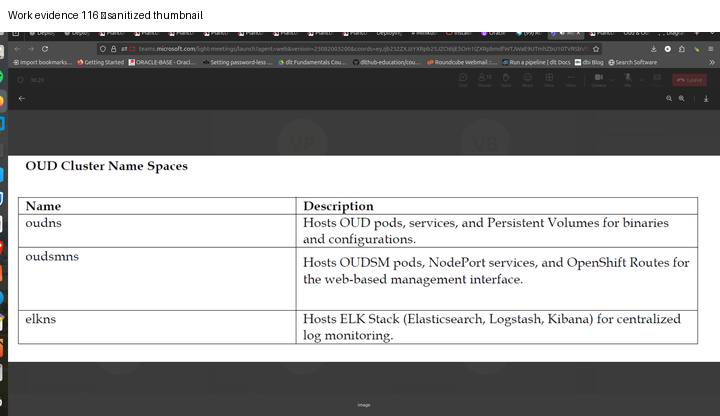

### Evidence 117

- Source: `Screenshot from 2026-07-28 22-50-15.png`
- Category: OUDSM access, topology and platform validation
- SHA-256: `c51a4c110cf720e68ddfff851aaf12f08ab72dbf36c26e7dfc1046bf3a9cf9b5`

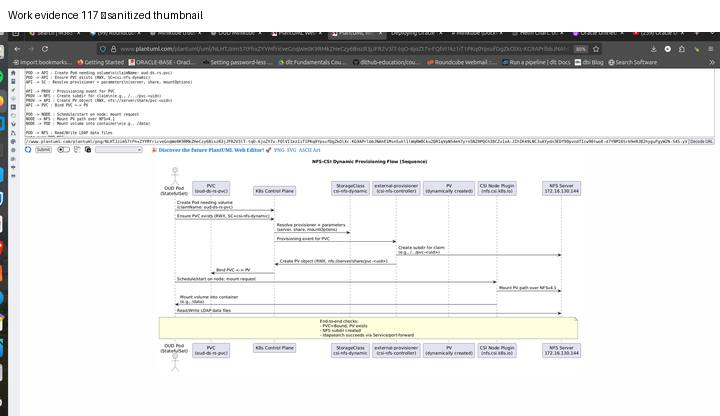

### Evidence 118

- Source: `Screenshot from 2026-07-28 22-50-18.png`
- Category: OUDSM access, topology and platform validation
- SHA-256: `8393267971dcfa00a54bf48f6012f6009995b463b432038664e3847a8bb4161f`

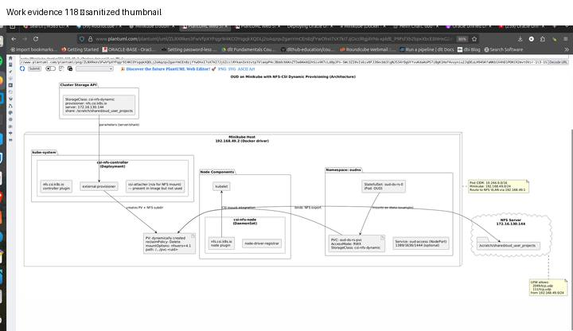

### Evidence 119

- Source: `Screenshot from 2026-07-28 22-50-21.png`
- Category: OUDSM access, topology and platform validation
- SHA-256: `0bdbe6c6f07ba8538f72082006683fa3b60437f369c4e8a7ae30922cdb99840d`

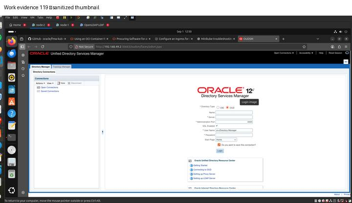

### Evidence 120

- Source: `Screenshot from 2026-07-28 22-50-31.png`
- Category: OUDSM access, topology and platform validation
- SHA-256: `a8b5c24fc9971f5565883edb0ce370e8a4473ac9facb999dac99c60b42a92486`

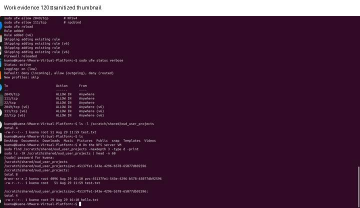

### Evidence 121

- Source: `Screenshot from 2026-07-28 22-50-52.png`
- Category: OUDSM access, topology and platform validation
- SHA-256: `3260e1ace75016028fedd52fb78aa3909ebc0857d59df3fdfca120d257e53dbf`

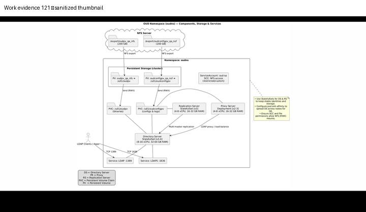

### Evidence 122

- Source: `Screenshot from 2026-07-28 22-50-54.png`
- Category: OUDSM access, topology and platform validation
- SHA-256: `c83e3e910dd755cf785bca5b49bb14948610747967fccf2e17e0a94589283c18`

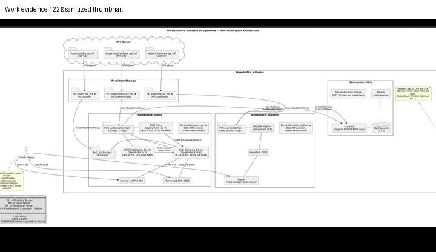

### Evidence 123

- Source: `Screenshot from 2026-07-28 22-51-13.png`
- Category: Documentation review and final operational checks
- SHA-256: `5a56d7281e38669736f5d5a2df999014c6fa6a217146d8e6d9b468d4246b6963`

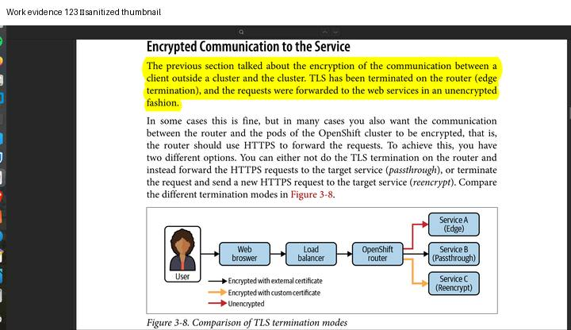

### Evidence 124

- Source: `Screenshot from 2026-07-28 22-51-18.png`
- Category: Documentation review and final operational checks
- SHA-256: `1d52817d62b62f523f085250c5bd8a97b1d3e0f9212e6f90071674093d0894a5`

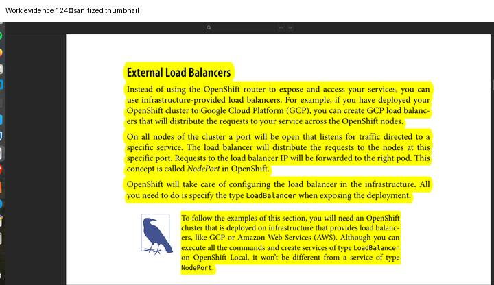

### Evidence 125

- Source: `Screenshot from 2026-07-28 22-51-21.png`
- Category: Documentation review and final operational checks
- SHA-256: `2e4f07da01fc7453437a6ff0a6d6c1fe634c7835cf1d863c0cc9e76176e08a7c`

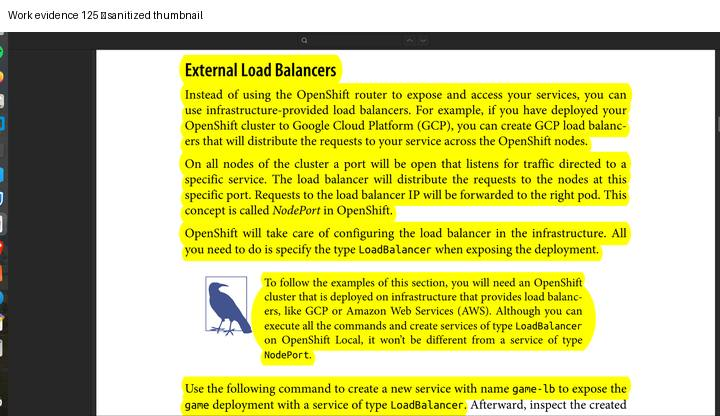

### Evidence 126

- Source: `Screenshot from 2026-07-28 22-51-23.png`
- Category: Documentation review and final operational checks
- SHA-256: `08d64a24dbf7c0c2cc2df730cc4bfc0b787f2b02b3956be5cb35ffc9f34ae037`

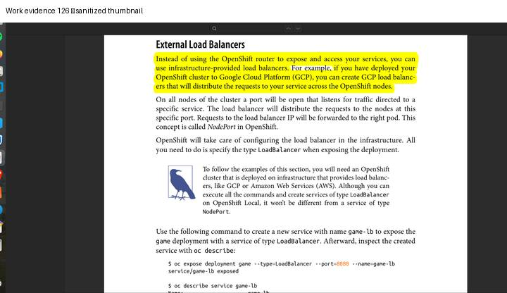

### Evidence 127

- Source: `Screenshot from 2026-07-28 22-51-28.png`
- Category: Documentation review and final operational checks
- SHA-256: `0c6c040615eda4a4bf7575a6c21cfb602698b53679fe39b0f242fb237a318552`

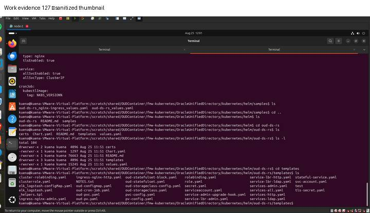

### Evidence 128

- Source: `Screenshot from 2026-07-28 22-51-59.png`
- Category: Documentation review and final operational checks
- SHA-256: `b15bad1aa3149bd7307772c59756aeba001e4f0a09c677b530fd9a1007df6810`

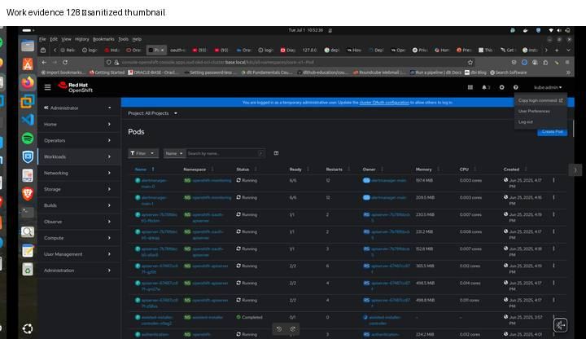

### Evidence 129

- Source: `Screenshot from 2026-07-28 22-52-06.png`
- Category: Documentation review and final operational checks
- SHA-256: `83a10dc4cb1230afcfbb50d7649c15af594d8d527c975d08b96fd32266b3ea7d`

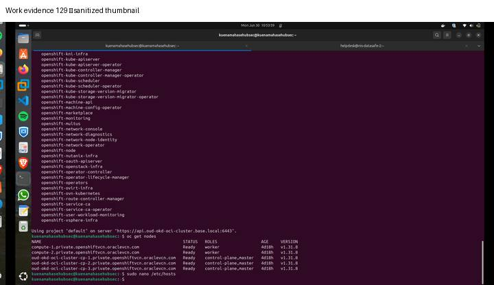

### Evidence 130

- Source: `Screenshot from 2026-07-28 22-52-14.png`
- Category: Documentation review and final operational checks
- SHA-256: `cadd1a3e1edc2c8f993a3803bdc1aea837ae310afdd19d6afeb56535e2a80547`

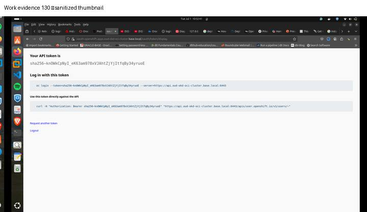
